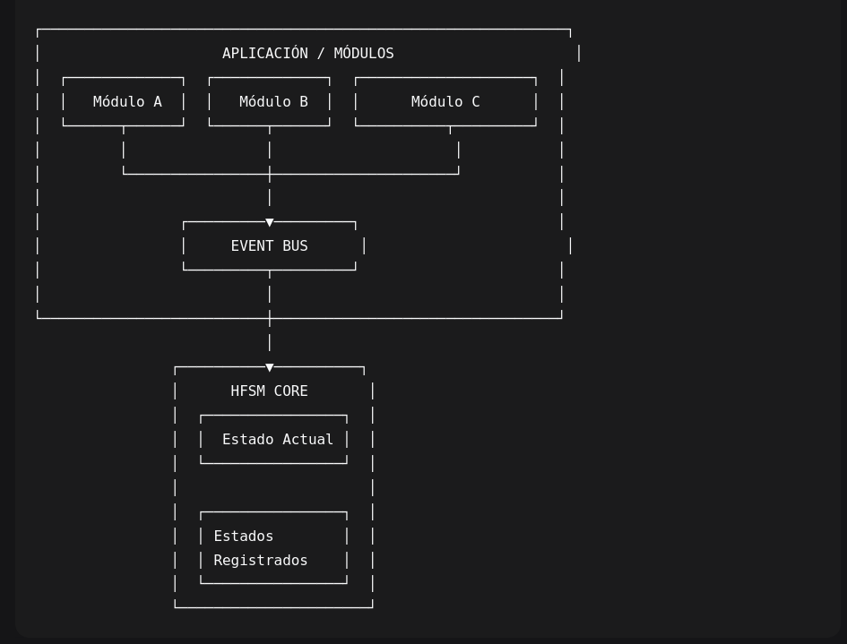
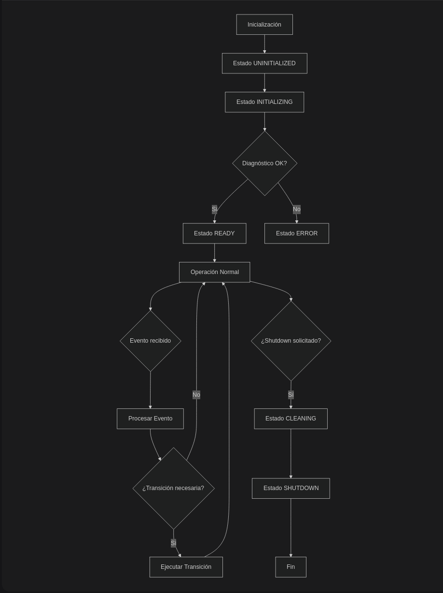
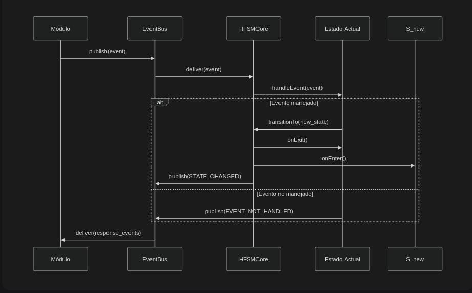
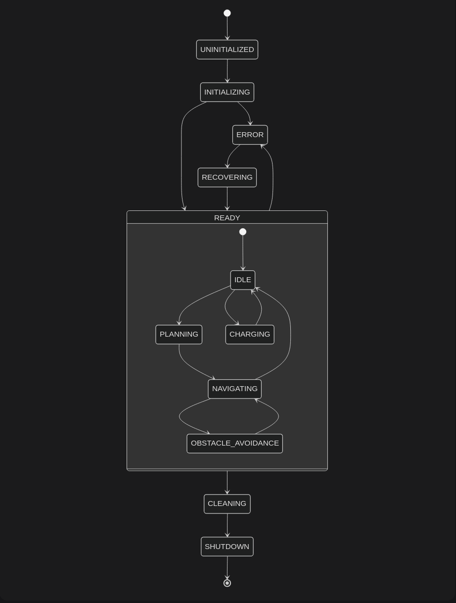

# Documentación Técnica: HFSMCore v6.0

## Índice

1.  Visión General
2.  Arquitectura del Sistema
3.  Componentes Principales
4.  API de la HFSMCore
5.  Ejemplos de Uso
6.  Diagramas de Flujo
7.  Mejores Prácticas
8.  Solución de Problemas

## Visión General

**HFSMCore** es el núcleo de una Máquina de Estados Jerárquica
(Hierarchical Finite State Machine) diseñada para sistemas robóticos y
embebidos. Proporciona una arquitectura robusta y extensible para la
gestión de estados, eventos y transiciones en sistemas complejos.

### Características Principales

-   **Arquitectura basada en eventos** - Comunicación asíncrona entre
    componentes
-   **Gestión jerárquica de estados** - Soporte para estados anidados
    y composición
-   **Thread-safe** - Diseñado para sistemas concurrentes
-   **Abstracción de hardware** - Separación completa de lógica y
    hardware
-   **Sistema de logging estructurado** - Trazabilidad completa de
    operaciones
-   **Gestión de errores robusta** - Mecanismos de recuperación y
    fallback

## Arquitectura del Sistema

### Diagrama de Componentes

### Flujo de Datos

1.  **Módulos externos** publican eventos en el EventBus
2.  **EventBus** distribuye eventos a los suscriptores
3.  **HFSMCore** recibe eventos y los procesa en el estado actual
4.  **Estados** procesan eventos y pueden:

    -   Cambiar a otro estado
    -   Publicar nuevos eventos
    -   Ejecutar acciones internas

5.  **Resultados** se propagan a través del EventBus

## Componentes Principales

### 1. **EventBus** - Sistema de Publicación/Suscripción

class EventBus {

// Publicar eventos
void publish(const Event& event);

// Suscribirse a tipos de eventos

void subscribe(const std::string& id, uint32_t event_type,
std::function\<void(const Event&)\> callback, int priority = 0);

// Procesar eventos pendientes

bool processOne();

};

### 2. **IState** - Interfaz Base para Estados

class IState {

virtual bool onEnter() = 0; // Al entrar al estado

virtual bool onExit() = 0; // Al salir del estado

virtual void update() = 0; // Actualización periódica

virtual bool handleEvent(const Event& event) = 0; // Manejo de eventos

virtual bool canTransitionTo(uint32_t target) const = 0; // Validación

};

### 3. **HFSMCore** - Núcleo Principal

class HFSMCore {
// Gestión del ciclo de vida
ErrorCode initialize();
ErrorCode shutdown(bool emergency = false);

// Gestión de estados
ErrorCode registerState(std::unique_ptr\<IState\> state);
ErrorCode transitionTo(uint32_t target);

// Sistema de eventos
void publishEvent(const Event& event);
EventBus& getEventBus();

// Consulta de estado
uint32_t getCurrentStateType() const;
bool isRunning() const;
};

### 4. **Event** - Estructura de Datos para Eventos

struct Event {
EventType type; // Tipo de evento
EventData data; // Datos del evento (variant)
std::chrono::system_clock::time_point timestamp; // Marca temporal
std::string source_module; // Origen del evento
uint32_t sequence_number{0}; // Número de secuencia
int priority{0}; // Prioridad (0=normal, \>0=alta)

// Métodos de utilidad
template\<typename T\>
std::optional\<T\> getDataAs() const; // Obtener datos tipados
};

## API de la HFSMCore

### Inicialización y Configuración

#### *HFSMCore::initialize()*

ErrorCode HFSMCore::initialize()

**Descripción:** Inicializa la HFSM, crea el thread principal y
establece el estado inicial.

**Retorno:**

-   *ErrorCode::SUCCESS* - Inicialización exitosa
-   *ErrorCode::ALREADY_INITIALIZED* - Ya estaba inicializada
-   *ErrorCode::THREAD_START_FAILED* - Error al crear el thread

**Ejemplo:**

**HFSMCore hfsm;**
**ErrorCode result = hfsm.initialize();**
**if (result != ErrorCode::SUCCESS) {**
** std::cerr \<\< \"Error al inicializar HFSM: \" \<\<
static_cast\<int\>(result) \<\< std::endl;**
**}**

#### *HFSMCore::shutdown()*

ErrorCode HFSMCore::shutdown(bool emergency = false)

**Descripción:** Apaga la HFSM de manera controlada o de emergencia.

**Parámetros:**

-   *emergency*: Si es *true*, apagado inmediato; si es *false*, apagado
    elegante

**Retorno:**

-   *ErrorCode::SUCCESS* - Apagado exitoso
-   *ErrorCode::SHUTDOWN_IN_PROGRESS* - Ya se está apagando
-   *ErrorCode::GRACEFUL_SHUTDOWN_TIMEOUT* - Timeout en apagado elegante

**Ejemplo:**

// Apagado elegante (recomendado)
ErrorCode result = hfsm.shutdown(false);
if (result == ErrorCode::GRACEFUL_SHUTDOWN_TIMEOUT) {
// Forzar apagado de emergencia
hfsm.shutdown(true);
}

### Gestión de Estados

#### *HFSMCore::registerState()*

ErrorCode HFSMCore::registerState(std::unique_ptr\<IState\> state)

**Descripción:** Registra un estado en la HFSM.

**Parámetros:**

-   *state*: Puntero único al estado a registrar

**Retorno:**

-   *ErrorCode::SUCCESS* - Registro exitoso
-   *ErrorCode::STATE_REGISTRATION_ERROR* - Error al registrar
-   *ErrorCode::INVALID_PARAMETER* - Estado nulo

**Ejemplo:**

// Crear y registrar un estado personalizado
auto myState = std::make_unique\<MyCustomState\>();
ErrorCode result = hfsm.registerState(std::move(myState));

#### *HFSMCore::transitionTo()*

ErrorCode HFSMCore::transitionTo(uint32_t target)

**Descripción:** Solicita una transición a otro estado.

**Parámetros:**

-   *target*: Tipo del estado destino

**Retorno:**

-   *ErrorCode::SUCCESS* - Transición exitosa
-   *ErrorCode::STATE_NOT_FOUND* - Estado destino no registrado
-   *ErrorCode::STATE_TRANSITION_ERROR* - Transición no permitida

**Ejemplo:**

// Transicionar al estado ERROR
ErrorCode result = hfsm.transitionTo(
static_cast\<uint32_t\>(StateType::ERROR)
);

### Sistema de Eventos

#### *HFSMCore::publishEvent()*

void HFSMCore::publishEvent(const Event& event)

**Descripción:** Publica un evento en el EventBus.

**Parámetros:**

-   *event*: Evento a publicar

**Ejemplo:**

// Publicar evento de batería baja
Event lowBatteryEvent(
EventType::LOW_BATTERY,
12.5, // Nivel de batería
\"BatteryMonitor\"
);
hfsm.publishEvent(lowBatteryEvent);

#### *HFSMCore::getEventBus()*

*EventBus& HFSMCore::getEventBus()*

***Descripción:** Obtiene referencia al EventBus para suscripciones
directas.*

**Retorno:** Referencia al EventBus interno

**Ejemplo:**

*// Suscribirse directamente al EventBus*
*hfsm.getEventBus().subscribe(*
* \"MyModule\",*
* static_cast\<uint32_t\>(EventType::EMERGENCY_STOP),*
* \[\](const Event& event) {*
* std::cout \<\< \"¡Parada de emergencia recibida!\" \<\< std::endl;*
* },*
* 10 // Alta prioridad*
*);*

### *Consulta de Estado*

#### *HFSMCore::getCurrentStateType()*

*uint32_t HFSMCore::getCurrentStateType() const*

***Descripción:** Obtiene el tipo del estado actual.*

**Retorno:** Tipo del estado actual

**Ejemplo:**

*uint32_t currentState = hfsm.getCurrentStateType();*
*if (currentState == static_cast\<uint32_t\>(StateType::ERROR)) {*
* std::cout \<\< \"Sistema en estado de error\" \<\< std::endl;*
*}*

#### *HFSMCore::isRunning()*

*bool HFSMCore::isRunning() const*

***Descripción:** Verifica si la HFSM está en ejecución.*

**Retorno:** *true* si está en ejecución, *false* en caso contrario

**Ejemplo:**

*while (hfsm.isRunning()) {*
* // Realizar operaciones mientras la HFSM está activa*
* std::this_thread::sleep_for(std::chrono::milliseconds(100));*
*}*

#### *HFSMCore::getStatistics()*

*nlohmann::json HFSMCore::getStatistics() const*

***Descripción:** Obtiene estadísticas de operación de la HFSM.*

**Retorno:** JSON con estadísticas

**Ejemplo:**

*auto stats = hfsm.getStatistics();*
*std::cout \<\< \"Estadísticas HFSM:\" \<\< std::endl;*
*std::cout \<\< \" Transiciones: \" \<\< stats\[\"state_transitions\"\]
\<\< std::endl;*
*std::cout \<\< \" Eventos procesados: \" \<\<
stats\[\"events_processed\"\] \<\< std::endl;*
*std::cout \<\< \" Errores: \" \<\< stats\[\"errors\"\] \<\< std::endl;*

## *Ejemplos de Uso*

### Ejemplo 1: Sistema Básico de Robot

*#include \"hfsm_core.hpp\"*
*#include \"RobotStates.hpp\"*
*#include \"RobotStateFactory.hpp\"*

*#include \<iostream\>*
*#include \<thread\>*

*class RobotController {*
*private:*
* ns_fsm::HFSMCore hfsm\_;*
* *
*public:*
* RobotController() {*
* setupStates();*
* setupEventSubscriptions();*
* }*
* *
* void start() {*
* std::cout \<\< \"Iniciando controlador de robot\...\" \<\< std::endl;*
* *
* // Inicializar HFSM*
* auto result = hfsm\_.initialize();*
* if (result != ns_fsm::ErrorCode::SUCCESS) {*
* throw std::runtime_error(\"Error al inicializar HFSM\");*
* }*
* *
* std::cout \<\< \"Robot listo para operar\" \<\< std::endl;*
* }*
* *
* void stop() {*
* std::cout \<\< \"Deteniendo controlador de robot\...\" \<\<
std::endl;*
* hfsm\_.shutdown(false); // Shutdown elegante*
* }*
* *
* void sendMission(const std::string& mission_data) {*
* ns_fsm::Event mission_event(*
* ns_fsm::EventType::MISSION_RECEIVED,*
* mission_data,*
* \"RobotController\"*
* );*
* hfsm\_.publishEvent(mission_event);*
* }*
* *
* void emergencyStop() {*
* ns_fsm::Event emergency_event(*
* ns_fsm::EventType::EMERGENCY_STOP,*
* \"Parada de emergencia solicitada\",*
* \"RobotController\"*
* );*
* hfsm\_.publishEvent(emergency_event);*
* }*
* *
*private:*
* void setupStates() {*
* // Registrar estados del robot usando la fábrica*
* std::vector\<ns_fsm::StateType\> robot_states = {*
* ns_fsm::StateType::INITIALIZING,*
* ns_fsm::StateType::IDLE,*
* ns_fsm::StateType::MISSION_PLANNING,*
* ns_fsm::StateType::NAVIGATING_TO_GOAL,*
* ns_fsm::StateType::OBSTACLE_AVOIDANCE,*
* ns_fsm::StateType::CHARGING,*
* ns_fsm::StateType::ERROR,*
* ns_fsm::StateType::SHUTDOWN,*
* ns_fsm::StateType::CLEANING*
* };*
* *
* for (auto state_type : robot_states) {*
* auto state = ns_fsm::createRobotState(state_type);*
* hfsm\_.registerState(std::move(state));*
* }*
* }*
* *
* void setupEventSubscriptions() {*
* // Suscribirse a eventos importantes*
* auto& event_bus = hfsm\_.getEventBus();*
* *
* // Monitorear cambios de estado*
* event_bus.subscribe(*
* \"RobotController_StateMonitor\",*
* static_cast\<uint32_t\>(ns_fsm::EventType::STATE_CHANGED),*
* \[\](const ns_fsm::Event& event) {*
* std::cout \<\< \"\[Estado cambiado\] \";*
* if (auto data = event.getDataAs\<std::string\>()) {*
* std::cout \<\< \*data;*
* }*
* std::cout \<\< std::endl;*
* }*
* );*
* *
* // Monitorear errores*
* event_bus.subscribe(*
* \"RobotController_ErrorMonitor\",*
* static_cast\<uint32_t\>(ns_fsm::EventType::CRITICAL_ERROR),*
* \[\](const ns_fsm::Event& event) {*
* std::cerr \<\< \"\[ERROR CRÍTICO\] \";*
* if (auto data = event.getDataAs\<std::string\>()) {*
* std::cerr \<\< \*data;*
* }*
* std::cerr \<\< std::endl;*
* },*
* 100 // Alta prioridad*
* );*
* }*
*};*
*// Función principal de ejemplo*
*int main() {*
* try {*
* RobotController robot;*
* *
* // Iniciar sistema*
* robot.start();*
* *
* // Simular operación normal*
* std::this_thread::sleep_for(std::chrono::seconds(2));*
* *
* // Enviar misión*
* robot.sendMission(\"Navegar a coordenadas X:10, Y:20\");*
* *
* // Esperar a que se procese*
* std::this_thread::sleep_for(std::chrono::seconds(5));*
* *
* // Simular batería baja*
* ns_fsm::Event low_battery(*
* ns_fsm::EventType::LOW_BATTERY,*
* 12.5,*
* \"BatterySimulator\"*
* );*
* *
* // Nota: En una aplicación real, esto vendría de un módulo de
hardware*
* *
* // Detener sistema*
* robot.stop();*
* *
* } catch (const std::exception& e) {*
* std::cerr \<\< \"Error: \" \<\< e.what() \<\< std::endl;*
* return 1;*
* }*
* *
* return 0;*
*}*

### *Ejemplo 2: Módulo de Monitoreo de Batería*

*#include \"hfsm_core.hpp\"*
*#include \<chrono\>*
*#include \<random\>*
*class BatteryMonitor {*
*private:*
* ns_fsm::HFSMCore& hfsm\_;*
* std::thread monitor_thread\_;*
* std::atomic\<bool\> running\_{false};*
* double current_battery_level\_{100.0};*
* *
*public:*
* BatteryMonitor(ns_fsm::HFSMCore& hfsm) : hfsm\_(hfsm) {*
* setupEventSubscriptions();*
* }*
* *
* \~BatteryMonitor() {*
* stop();*
* }*
* *
* void start() {*
* running\_ = true;*
* monitor_thread\_ = std::thread(&BatteryMonitor::monitorLoop, this);*
* }*
* *
* void stop() {*
* running\_ = false;*
* if (monitor_thread\_.joinable()) {*
* monitor_thread\_.join();*
* }*
* }*
* *
* void setBatteryLevel(double level) {*
* current_battery_level\_ = std::clamp(level, 0.0, 100.0);*
* *
* // Publicar evento basado en nivel*
* if (current_battery_level\_ \< 10.0) {*
* publishCriticalBattery();*
* } else if (current_battery_level\_ \< 20.0) {*
* publishLowBattery();*
* } else if (current_battery_level\_ \> 95.0) {*
* publishBatteryFull();*
* }*
* }*
* *
*private:*
* void monitorLoop() {*
* std::random_device rd;*
* std::mt19937 gen(rd());*
* std::uniform_real_distribution\<\> dis(-0.5, -0.1); // Descarga lenta*
* *
* while (running\_) {*
* // Simular descarga de batería*
* current_battery_level\_ += dis(gen);*
* current_battery_level\_ = std::max(0.0, current_battery_level\_);*
* *
* // Publicar nivel actual (solo si cambió significativamente)*
* static double last_reported_level = 100.0;*
* if (std::abs(current_battery_level\_ - last_reported_level) \> 1.0) {*
* publishBatteryLevel();*
* last_reported_level = current_battery_level\_;*
* }*
* *
* // Verificar umbrales críticos*
* if (current_battery_level\_ \< 5.0 && last_reported_level \>= 5.0) {*
* publishCriticalBattery();*
* } else if (current_battery_level\_ \< 15.0 && last_reported_level \>=
15.0) {*
* publishLowBattery();*
* }*
* *
* std::this_thread::sleep_for(std::chrono::seconds(1));*
* }*
* }*
* *
* void setupEventSubscriptions() {*
* auto& event_bus = hfsm\_.getEventBus();*
* *
* // Escuchar eventos de carga*
* event_bus.subscribe(*
* \"BatteryMonitor_Charging\",*
* static_cast\<uint32_t\>(ns_fsm::EventType::ROBOT_CHARGING_START),*
* \[this\](const ns_fsm::Event& event) {*
* std::cout \<\< \"\[BatteryMonitor\] Iniciando carga\" \<\< std::endl;*
* // Simular carga rápida*
* std::thread(\[this\]() {*
* for (int i = 0; i \< 10 && running\_; ++i) {*
* current_battery_level\_ += 10.0;*
* current_battery_level\_ = std::min(100.0, current_battery_level\_);*
* publishBatteryLevel();*
* std::this_thread::sleep_for(std::chrono::seconds(1));*
* }*
* }).detach();*
* }*
* );*
* }*
* *
* void publishBatteryLevel() {*
* ns_fsm::Event event(*
* ns_fsm::EventType::SYSTEM_HEALTH_STATUS,*
* current_battery_level\_,*
* \"BatteryMonitor\"*
* );*
* hfsm\_.publishEvent(event);*
* }*
* *
* void publishLowBattery() {*
* ns_fsm::Event event(*
* ns_fsm::EventType::LOW_BATTERY,*
* current_battery_level\_,*
* \"BatteryMonitor\"*
* );*
* hfsm\_.publishEvent(event);*
* }*
* *
* void publishCriticalBattery() {*
* ns_fsm::Event event(*
* ns_fsm::EventType::CRITICAL_BATTERY,*
* current_battery_level\_,*
* \"BatteryMonitor\"*
* );*
* hfsm\_.publishEvent(event);*
* }*
* *
* void publishBatteryFull() {*
* ns_fsm::Event event(*
* ns_fsm::EventType::ROBOT_CHARGING_COMPLETE,*
* \"Batería completamente cargada\",*
* \"BatteryMonitor\"*
* );*
* hfsm\_.publishEvent(event);*
* }*
*};*

### *Ejemplo 3: Sistema de Logging Integrado*

*#include \"hfsm_logging.hpp\"*
*#include \"hfsm_core.hpp\"*
*#include \<fstream\>*

*class AdvancedLogger {*
*private:*
* ns_fsm::HFSMLogger& logger\_;*
* std::ofstream log_file\_;*
* *
*public:*
* AdvancedLogger() : logger\_(ns_fsm::HFSMLogger::getInstance()) {*
* setupLogging();*
* }*
* *
* void setupLogging() {*
* // Configurar logger*
* ns_fsm::LogConfig config;*
* config.enable_structured_logging = true;*
* config.enable_file_logging = true;*
* config.enable_console_logging = true;*
* config.max_log_size_mb = 50;*
* config.max_log_files = 10;*
* config.min_level = hardware::DiagnosticLevel::DEBUG;*
* *
* logger\_.initialize(config);*
* *
* // Ejemplos de logging*
* logSystemStart();*
* }*
* *
* void logSystemStart() {*
* logger\_.logStructured(*
* \"System\",*
* hardware::DiagnosticLevel::INFO,*
* \"Sistema HFSM iniciado\",*
* {*
* {\"version\", \"6.0\"},*
* {\"timestamp\", getCurrentTimestamp()},*
* {\"components\", {\"EventBus\", \"StateMachine\", \"Logger\"}}*
* }*
* );*
* }*
* *
* void logStateTransition(ns_fsm::StateType from, ns_fsm::StateType to,
*
* const std::string& reason = \"\") {*
* ns_fsm::HFSM_LOG_TRANSITION(*
* static_cast\<uint32_t\>(from),*
* static_cast\<uint32_t\>(to),*
* reason,*
* true*
* );*
* }*
* *
* void logEvent(const ns_fsm::Event& event) {*
* ns_fsm::HFSM_LOG_EVENT(event, true, \"EventLogger\");*
* }*
* *
* void logError(ns_fsm::ErrorCode code, const std::string& context) {*
* ns_fsm::HFSM_LOG_ERROR(code, context, \"AdvancedLogger\");*
* }*
* *
* void logPerformance(const std::string& metric, double value, *
* const std::string& unit = \"\") {*
* ns_fsm::HFSM_LOG_PERFORMANCE(metric, value, unit);*
* }*
* *
* void logScope(const std::string& scope_name) {*
* // Usar macros de scope*
* HFSM_LOG_SCOPE_START(scope_name);*
* *
* // Operaciones dentro del scope\...*
* *
* HFSM_LOG_SCOPE_END(scope_name);*
* }*
* *
*private:*
* std::string getCurrentTimestamp() {*
* auto now = std::chrono::system_clock::now();*
* auto time_t_now = std::chrono::system_clock::to_time_t(now);*
* std::stringstream ss;*
* ss \<\< std::put_time(std::localtime(&time_t_now), \"%Y-%m-%d
%H:%M:%S\");*
* return ss.str();*
* }*
*};*

## *📊 Diagramas de Flujo*

### Diagrama 1: Ciclo de Vida de la HFSM

{width="9.645cm"
height="12.891cm"}

### Diagrama 2: Flujo de Eventos

{width="13.517cm"
height="8.386cm"}

### Diagrama 3: Jerarquía de Estados del Robot

{width="8.573cm"
height="11.324cm"}

## Mejores Prácticas

### 1. **Diseño de Estados**

// CORRECTO - Estado bien diseñado
class WellDesignedState : public RobotStateInterface {
bool handleEvent(const Event& event) override {
switch (event.type) {
case EventType::SPECIFIC_EVENT:

// Manejar evento específico
return true;

default:
// No manejar otros eventos
return false;
}

}

bool canTransitionTo(uint32_t target) const override {
// Definir explícitamente transiciones permitidas
return target == StateType::NEXT_STATE \|\|
target == StateType::ERROR_STATE;
}
};

// INCORRECTO - Estado mal diseñado
class BadState : public RobotStateInterface {
bool handleEvent(const Event& event) override {
// Manejar TODOS los eventos
// Lógica de hardware directa
// Transiciones implícitas
return true; // Siempre retorna true
}
};

### 2. **Gestión de Eventos**

// CORRECTO - Publicación de eventos

void publishEventSafely() {
// Validar datos antes de publicar
if (isDataValid()) {
Event event(
EventType::DATA_READY,
getProcessedData(),
\"ModuleName\",
getCurrentTimestamp(),
0 // Prioridad normal
);

hfsm.publishEvent(event);
}
}

// CORRECTO - Suscripción robusta
void setupSubscriptions() {
hfsm.getEventBus().subscribe(
\"UniqueModuleID\",
static_cast\<uint32_t\>(EventType::IMPORTANT_EVENT),
\[this\](const Event& event) {

try {
processImportantEvent(event);
} catch (const std::exception& e) {

// Manejar error sin romper el sistema
logError(\"Error processing event\", e.what());
}
},
10 // Prioridad adecuada
);
}

### 3. **Manejo de Errores**

//  CORRECTO - Manejo robusto de errores
ErrorCode performCriticalOperation() {

try {
// Operación que puede fallar
if (!criticalOperation()) {
// Error específico
return ErrorCode::OPERATION_FAILED;
}

// Publicar evento de éxito
publishEvent(EventType::OPERATION_SUCCESS);
return ErrorCode::SUCCESS;
} catch (const std::exception& e) {

// Error no esperado
publishEvent(EventType::SYSTEM_ERROR, e.what());
return ErrorCode::CRITICAL_FAILURE;
}
}

// CORRECTO - Recuperación de errores
void handleErrorState() {
// 1. Detener operaciones peligrosas
emergencyStop();

// 2. Diagnosticar el problema
ErrorInfo diagnosis = diagnoseError();

// 3. Intentar recuperación automática
if (canRecoverAutomatically(diagnosis)) {
attemptRecovery();
} else {
// 4. Solicitar intervención
requestHumanIntervention(diagnosis);
}
}

### 4. **Performance y Optimización**

// CORRECTO - Optimización de eventos

class OptimizedModule {
private:
EventBus& event_bus\_;
uint32_t last_event_type\_{0};
public:
void publishOptimizedEvent(EventType type, const EventData& data) {

// Evitar publicar eventos duplicados consecutivos
if (type != last_event_type\_) {
Event event(type, data, \"OptimizedModule\");
event_bus\_.publish(event);
last_event_type\_ = type;
}
}
};

// CORRECTO - Uso eficiente de memoria

void createStatesEfficiently() {

// Usar fábrica para creación bajo demanda
auto state_factory = RobotStateFactory::getInstance();

// Crear solo los estados necesarios
std::vector\<uint32_t\> required_states = {
static_cast\<uint32_t\>(StateType::IDLE),
static_cast\<uint32_t\>(StateType::NAVIGATING)
};

for (auto state_type : required_states) {
auto state = state_factory.createState(state_type);
// Configurar estado\...
}
}

## Solución de Problemas

### Problema Común 1: **Eventos no se están procesando**

**Síntomas:**

-   Eventos se publican pero no se procesan
-   Estados no responden a eventos

**Solución:**

// Verificar que la HFSM esté inicializada
if (!hfsm.isInitialized()) {
hfsm.initialize();
}

// Verificar suscripciones
auto& event_bus = hfsm.getEventBus();
auto stats = event_bus.getStats();
std::cout \<\< \"Suscriptores activos: \" \<\< stats.total_subscribers
\<\< std::endl;

// Depurar publicación de eventos
hfsm.getEventBus().subscribe(
\"DebugMonitor\",
static_cast\<uint32_t\>(EventType::ALL), // Usar 0 para todos los
eventos
\[\](const Event& event) {
std::cout \<\< \"\[DEBUG\] Evento publicado: \"
\<\< eventTypeToString(event.type)
\<\< \" desde \" \<\< event.source_module
\<\< std::endl;
}
);

### Problema Común 2: **Transiciones que fallan**

**Síntomas:**

-   *transitionTo()* retorna error
-   Estado no cambia aunque debería

**Solución:**

ErrorCode result = hfsm.transitionTo(target_state);

if (result != ErrorCode::SUCCESS) {
// Diagnosticar el problema
std::cout \<\< \"Error en transición: \" \<\< static_cast\<int\>(result)
\<\< std::endl;

// Verificar si el estado destino existe
if (!hfsm.isStateRegistered(target_state)) {
std::cout \<\< \"Estado no registrado: \" \<\< target_state \<\<
std::endl;
}

// Verificar si la transición es permitida
uint32_t current_state = hfsm.getCurrentStateType();
if (!hfsm.isStateTransitionPossible(current_state, target_state)) {
std::cout \<\< \"Transición no permitida de \"
\<\< current_state \<\< \" a \" \<\< target_state \<\< std::endl;
}
}

### Problema Común 3: **Deadlocks o Bloqueos**

**Síntomas:**

-   HFSM se congela
-   No responde a eventos

**Solución:**

// 1. Verificar timeout de estados
auto current_state_type = hfsm.getCurrentStateType();
auto state = hfsm.getState(current_state_type); // Método hipotético

if (state) {
auto timeout = state-\>getTimeout();
std::cout \<\< \"Timeout configurado: \" \<\< timeout.count() \<\<
\"ms\" \<\< std::endl;
}

// 2. Verificar bloqueos en mutex
// Añadir logs en puntos críticos

class DebugHFSM : public HFSMCore {
void transitionToInternal(uint32_t target, bool emergency) override {
std::cout \<\< \"\[DEBUG\] Iniciando transición a \" \<\< target \<\<
std::endl;
HFSMCore::transitionToInternal(target, emergency);
std::cout \<\< \"\[DEBUG\] Transición completada\" \<\< std::endl;
}
};

// 3. Usar shutdown de emergencia si es necesario

if (system_is_frozen) {
hfsm.shutdown(true); // Shutdown inmediato
}

### Problema Común 4: **Fugas de Memoria**

**Síntomas:**

-   Uso de memoria crece constantemente
-   Performance degrada con el tiempo

**Solución:**

// 1. Usar smart pointers correctamente
std::unique_ptr\<IState\> createState() {
return std::make_unique\<MyState\>(); // CORRECTO
// return new MyState(); // INCORRECTO
}

// 2. Limpiar eventos antiguos del EventBus
void cleanupOldEvents() {
auto& event_bus = hfsm.getEventBus();
auto stats = event_bus.getStats();

if (stats.pending_events \> 1000) {
std::cout \<\< \"Muchos eventos pendientes: \"
\<\< stats.pending_events \<\< std::endl;
// Considerar aumentar la prioridad del procesamiento
}
}

// 3. Monitorizar uso de memoria

#include \<sys/resource.h\>
void monitorMemoryUsage() {
struct rusage usage;
getrusage(RUSAGE_SELF, &usage);
std::cout \<\< \"Uso de memoria: \"
\<\< usage.ru_maxrss \<\< \" KB\" \<\< std::endl;
}

## Estadísticas y Monitoreo

### Métricas Clave a Monitorear

void monitorHFSMHealth(const HFSMCore& hfsm) {
// 1. Estadísticas básicas
auto stats = hfsm.getStatistics();
std::cout \<\< \"=== ESTADÍSTICAS HFSM ===\" \<\< std::endl;
std::cout \<\< \"Ciclos totales: \" \<\< stats\[\"total_loops\"\] \<\<
std::endl;

std::cout \<\< \"Eventos procesados: \" \<\<
stats\[\"events_processed\"\] \<\< std::endl;

std::cout \<\< \"Transiciones de estado: \" \<\<
stats\[\"state_transitions\"\] \<\< std::endl;

std::cout \<\< \"Errores: \" \<\< stats\[\"errors\"\] \<\< std::endl;

// 2. Estado actual

std::cout \<\< \"\\n=== ESTADO ACTUAL ===\" \<\< std::endl;

std::cout \<\< \"Tipo: \" \<\< hfsm.getCurrentStateType() \<\<
std::endl;

std::cout \<\< \"Nombre: \" \<\< hfsm.getCurrentStateName() \<\<
std::endl;

std::cout \<\< \"Inicializado: \" \<\< (hfsm.isInitialized() ? \"Sí\" :
\"No\") \<\< std::endl;

std::cout \<\< \"En ejecución: \" \<\< (hfsm.isRunning() ? \"Sí\" :
\"No\") \<\< std::endl;

// 3. EventBus

auto& event_bus = hfsm.getEventBus();
auto bus_stats = event_bus.getStats();
std::cout \<\< \"\\n=== EVENT BUS ===\" \<\< std::endl;

std::cout \<\< \"Eventos pendientes: \" \<\< bus_stats.pending_events
\<\< std::endl;

std::cout \<\< \"Suscriptores totales: \" \<\<
bus_stats.total_subscribers \<\< std::endl;

std::cout \<\< \"Tipos de eventos: \" \<\< bus_stats.event_types \<\<
std::endl;
}

### Dashboard de Monitoreo en Tiempo Real

class HFSMDashboard {
private:
const HFSMCore& hfsm\_;
std::thread monitor_thread\_;
std::atomic\<bool\> running\_{false};

public:
HFSMDashboard(const HFSMCore& hfsm) : hfsm\_(hfsm) {}

void start() {
running\_ = true;
monitor_thread\_ = std::thread(&HFSMDashboard::monitorLoop, this);
}

void stop() {
running\_ = false;
if (monitor_thread\_.joinable()) {
monitor_thread\_.join();
}
}

private:
void monitorLoop() {
while (running\_) {
displayDashboard();
std::this_thread::sleep_for(std::chrono::seconds(1));
}
}

void displayDashboard() {
system(\"clear\"); // Limpiar consola (Linux/Mac)

std::cout \<\< \"╔════════════════════════════════════════════╗\" \<\<
std::endl;
std::cout \<\< \"║ DASHBOARD HFSM v6.0 - TIEMPO REAL ║\" \<\< std::endl;
std::cout \<\< \"╠════════════════════════════════════════════╣\" \<\<
std::endl;

// Estado actual

std::cout \<\< \"║ Estado: \" \<\< std::setw(35) \<\< std::left
\<\< hfsm\_.getCurrentStateName() \<\< \"║\" \<\< std::endl;

// Estadísticas
auto stats = hfsm\_.getStatistics();
std::cout \<\< \"║ Transiciones: \" \<\< std::setw(31) \<\< std::left
\<\< stats\[\"state_transitions\"\].get\<uint64_t\>() \<\< \"║\" \<\<
std::endl;

std::cout \<\< \"║ Eventos/min: \" \<\< std::setw(32) \<\< std::left
\<\< calculateEventsPerMinute() \<\< \"║\" \<\< std::endl;
std::cout \<\< \"║ Uptime: \" \<\< std::setw(36) \<\< std::left
\<\< formatUptime() \<\< \"║\" \<\< std::endl;

// Health status
std::cout \<\< \"║ Health: \" \<\< std::setw(36) \<\< std::left
\<\< calculateHealthStatus() \<\< \"║\" \<\< std::endl;

std::cout \<\< \"╚════════════════════════════════════════════╝\" \<\<
std::endl;
std::cout \<\< \"\\nPresione Ctrl+C para salir\...\" \<\< std::endl;

}

uint64_t calculateEventsPerMinute() {
static uint64_t last_count = 0;
static auto last_time = std::chrono::steady_clock::now();
auto current_stats = hfsm\_.getStatistics();
uint64_t current_count = current_stats\[\"events_processed\"\];
auto current_time = std::chrono::steady_clock::now();

auto elapsed = std::chrono::duration_cast\<std::chrono::seconds\>(
current_time - last_time).count();

if (elapsed \>= 60) {
uint64_t events_per_minute = (current_count - last_count) \* 60 /
elapsed;
last_count = current_count;
last_time = current_time;
return events_per_minute;
}

return 0;

}

std::string formatUptime() {
// Implementar cálculo de uptime
return \"00:00:00\"; // Placeholder
}

std::string calculateHealthStatus() {
auto stats = hfsm\_.getStatistics();
uint64_t errors = stats\[\"errors\"\].get\<uint64_t\>();
uint64_t events = stats\[\"events_processed\"\].get\<uint64_t\>();

if (events == 0) return \"INACTIVO\";
double error_rate = static_cast\<double\>(errors) / events \* 100;

if (error_rate \< 1.0) return \"EXCELENTE\";
else if (error_rate \< 5.0) return \"BUENO\";
else if (error_rate \< 10.0) return \"ADVERTENCIA\";
else return \"CRÍTICO\";
}
};

## Conclusión

La **HFSMCore v6.0** proporciona una base sólida para implementar
máquinas de estados jerárquicas en sistemas robóticos y embebidos. Su
arquitectura basada en eventos, gestión robusta de errores y sistema de
logging integrado la hacen adecuada para aplicaciones críticas.

### Puntos Clave a Recordar:

1.  **Abstracción Total**: La HFSM nunca accede directamente al hardware
2.  **Comunicación por Eventos**: Todos los componentes se comunican a
    través del EventBus
3.  **Thread-Safe**: Diseñada para operación concurrente
4.  **Extensible**: Fácil de extender con nuevos estados y módulos
5.  **Monitorizable**: Estadísticas detalladas y logging estructurado

### Recursos Adicionales:

-   **Documentación Completa**: Disponible en */docs/hfsm/*
-   **Ejemplos de Código**: En */examples/hfsm/*
-   **Herramientas de Depuración**: En */tools/hfsm_debug/*
-   **Plantillas de Estados**: En */templates/states/*

Para más información o soporte técnico, consultar la documentación
completa o contactar al equipo de desarrollo.

# Guía Completa: Registro de Estados en HFSM Core

## Métodos de Registro Disponibles

### 1. **Registro Manual Estado por Estado** (Recomendado para control fino)

// Método 1: Registro directo usando std::make_unique

#include \"hfsm_core.hpp\"
#include \"RobotStates.hpp\"

void registerStatesManually(HFSMCore& hfsm) {
std::cout \<\< \"=== REGISTRO MANUAL DE ESTADOS ===\" \<\< std::endl;

// Registrar cada estado individualmente
ErrorCode result;

// Estado STARTUP
result = hfsm.registerState(
std::make_unique\<StartupState\>()
);

if (result == ErrorCode::SUCCESS) {
std::cout \<\< \"✓ StartupState registrado\" \<\< std::endl;
}

// Estado IDLE
result = hfsm.registerState(
std::make_unique\<IdleState\>()
);

if (result == ErrorCode::SUCCESS) {
std::cout \<\< \"✓ IdleState registrado\" \<\< std::endl;
}

// Estado PLANNING
result = hfsm.registerState(

std::make_unique\<PlanningState\>()
);

if (result == ErrorCode::SUCCESS) {
std::cout \<\< \"✓ PlanningState registrado\" \<\< std::endl;
}

// Estado NAVIGATING
result = hfsm.registerState(
std::make_unique\<NavigatingState\>()
);

if (result == ErrorCode::SUCCESS) {
std::cout \<\< \"✓ NavigatingState registrado\" \<\< std::endl;
}

// Estado OBSTACLE_AVOIDANCE
result = hfsm.registerState(

std::make_unique\<ObstacleAvoidanceState\>()
);

if (result == ErrorCode::SUCCESS) {
std::cout \<\< \"✓ ObstacleAvoidanceState registrado\" \<\< std::endl;
}

// Estado CHARGING
result = hfsm.registerState(
std::make_unique\<ChargingState\>()
);

if (result == ErrorCode::SUCCESS) {
std::cout \<\< \"✓ ChargingState registrado\" \<\< std::endl;
}

// Estado ERROR

result = hfsm.registerState(
std::make_unique\<ErrorState\>()
);

if (result == ErrorCode::SUCCESS) {
std::cout \<\< \"✓ ErrorState registrado\" \<\< std::endl;
}

// Estado TELEOPERATION

result = hfsm.registerState(
std::make_unique\<TeleoperationState\>()
);

if (result == ErrorCode::SUCCESS) {
std::cout \<\< \"✓ TeleoperationState registrado\" \<\< std::endl;
}

// Estados del sistema base (opcionales pero recomendados)
result = hfsm.registerState(
std::make_unique\<CleaningState\>()
);

if (result == ErrorCode::SUCCESS) {
std::cout \<\< \"✓ CleaningState registrado\" \<\< std::endl;
}

result = hfsm.registerState(
std::make_unique\<ShutdownState\>()
);

if (result == ErrorCode::SUCCESS) {
std::cout \<\< \"✓ ShutdownState registrado\" \<\< std::endl;
}

std::cout \<\< \"==================================\" \<\< std::endl;

}

### 2. **Registro Automático usando la Fábrica de Estados** (Recomendado para producción)

// Método 2: Registro automático con fábrica
#include \"RobotStateFactory.hpp\"

void registerStatesWithFactory(HFSMCore& hfsm, bool
include_system_states = true) {
std::cout \<\< \"=== REGISTRO AUTOMÁTICO CON FÁBRICA ===\" \<\<
std::endl;

// Definir lista de estados del robot
std::vector\<StateType\> robot_states = {
StateType::INITIALIZING, // StartupState
StateType::IDLE,
StateType::MISSION_PLANNING, // PlanningState
StateType::NAVIGATING_TO_GOAL, // NavigatingState
StateType::OBSTACLE_AVOIDANCE,
StateType::CHARGING,
StateType::ERROR,
StateType::TELEOPERATION
};

// Opcional: incluir estados del sistema

if (include_system_states) {
robot_states.push_back(StateType::CLEANING);
robot_states.push_back(StateType::SHUTDOWN);
robot_states.push_back(StateType::READY);
robot_states.push_back(StateType::OPERATIONAL);
robot_states.push_back(StateType::RECOVERING);
}

int success_count = 0;
int error_count = 0;

// Registrar todos los estados
for (auto state_type : robot_states) {
try {
// Crear estado usando la fábrica
auto state = RobotStateFactory::getInstance().createState(
static_cast\<uint32_t\>(state_type)
);

if (state) {
ErrorCode result = hfsm.registerState(std::move(state));

if (result == ErrorCode::SUCCESS) {
success_count++;
std::cout \<\< \"✓ \" \<\< stateTypeToString(state_type)
\<\< \" registrado\" \<\< std::endl;
} else {
error_count++;
std::cerr \<\< \"✗ Error registrando \"
\<\< stateTypeToString(state_type)
\<\< \": \" \<\< static_cast\<int\>(result) \<\< std::endl;
}

} else {
error_count++;
std::cerr \<\< \"✗ Fábrica no pudo crear estado: \"
\<\< stateTypeToString(state_type) \<\< std::endl;
}

} catch (const std::exception& e) {
error_count++;
std::cerr \<\< \"✗ Excepción registrando \"
\<\< stateTypeToString(state_type)
\<\< \": \" \<\< e.what() \<\< std::endl;
}
}

std::cout \<\< \"\\nResumen: \" \<\< success_count \<\< \" exitosos, \"
\<\< error_count \<\< \" errores\" \<\< std::endl;
std::cout \<\< \"=======================================\" \<\<
std::endl;
}

### 3. **Registro desde Archivo de Configuración** (Para máxima flexibilidad)

// Método 3: Registro basado en configuración JSON
#include \<fstream\>
#include \<nlohmann/json.hpp\>

void registerStatesFromConfig(HFSMCore& hfsm, const std::string&
config_path) {
std::cout \<\< \"=== REGISTRO DESDE CONFIGURACIÓN ===\" \<\< std::endl;

try {
// Leer archivo de configuración
std::ifstream config_file(config_path);
if (!config_file.is_open()) {
throw std::runtime_error(\"No se pudo abrir archivo de configuración:
\" + config_path);
}

nlohmann::json config;
config_file \>\> config_file;

// Obtener lista de estados desde configuración
auto states_config = config\[\"hfsm\"\]\[\"states\"\];

if (!states_config.is_array()) {
throw std::runtime_error(\"Configuración de estados no es un array\");
}

int registered = 0;
for (const auto& state_config : states_config) {

// Extraer información del estado
std::string state_name = state_config\[\"name\"\];
uint32_t state_type = state_config\[\"type\"\];
std::string state_class = state_config\[\"class\"\];
std::cout \<\< \"Registrando estado: \" \<\< state_name
\<\< \" (tipo: \" \<\< state_type \<\< \")\" \<\< std::endl;

// Crear estado basado en la clase especificada
std::unique_ptr\<IState\> state;
if (state_class == \"StartupState\") {
state = std::make_unique\<StartupState\>();
} else if (state_class == \"IdleState\") {
state = std::make_unique\<IdleState\>();
} else if (state_class == \"PlanningState\") {
state = std::make_unique\<PlanningState\>();
} else if (state_class == \"NavigatingState\") {
state = std::make_unique\<NavigatingState\>();
} else if (state_class == \"ObstacleAvoidanceState\") {
state = std::make_unique\<ObstacleAvoidanceState\>();
} else if (state_class == \"ChargingState\") {
state = std::make_unique\<ChargingState\>();
} else if (state_class == \"ErrorState\") {
state = std::make_unique\<ErrorState\>();
} else if (state_class == \"TeleoperationState\") {
state = std::make_unique\<TeleoperationState\>();
} else {
std::cerr \<\< \" ✗ Clase de estado desconocida: \" \<\< state_class
\<\< std::endl;

continue;
}

// Registrar estado en HFSM
ErrorCode result = hfsm.registerState(std::move(state));

if (result == ErrorCode::SUCCESS) {
std::cout \<\< \" ✓ Estado registrado exitosamente\" \<\< std::endl;
registered++;
} else {
std::cerr \<\< \" ✗ Error al registrar: \" \<\<
static_cast\<int\>(result) \<\< std::endl;
}
}

std::cout \<\< \"\\nTotal estados registrados: \" \<\< registered \<\<
std::endl;
std::cout \<\< \"==================================\" \<\< std::endl;

} catch (const std::exception& e) {
std::cerr \<\< \"Error en registro desde configuración: \" \<\< e.what()
\<\< std::endl;
}
}

// Ejemplo de archivo de configuración (config/hfsm_states.json):

/\*

{

\"hfsm\": {

\"states\": \[

{

\"name\": \"Startup\",

\"type\": 1,

\"class\": \"StartupState\",

\"timeout_ms\": 30000,

\"initial\": true

},

{

\"name\": \"Idle\",

\"type\": 21,

\"class\": \"IdleState\",

\"timeout_ms\": 3600000

},

{

\"name\": \"Planning\",

\"type\": 22,

\"class\": \"PlanningState\",

\"timeout_ms\": 15000

},

{

\"name\": \"Navigating\",

\"type\": 100,

\"class\": \"NavigatingState\",

\"timeout_ms\": 1800000

},

{

\"name\": \"ObstacleAvoidance\",

\"type\": 102,

\"class\": \"ObstacleAvoidanceState\",

\"timeout_ms\": 30000

},

{

\"name\": \"Charging\",

\"type\": 111,

\"class\": \"ChargingState\",

\"timeout_ms\": 7200000

},

{

\"name\": \"Error\",

\"type\": 7,

\"class\": \"ErrorState\",

\"timeout_ms\": 300000

},

{

\"name\": \"Teleoperation\",

\"type\": 105,

\"class\": \"TeleoperationState\",

\"timeout_ms\": 14400000

}

\]

}

}

\*/

## 🔧 Ejemplo Completo de Sistema Robótico

// robot_system.cpp - Sistema robótico completo

#include \"hfsm_core.hpp\"

#include \"RobotStateFactory.hpp\"

#include \"hfsm_logging.hpp\"

#include \<iostream\>

#include \<memory\>

#include \<thread\>

#include \<atomic\>

class RobotSystem {

private:

ns_fsm::HFSMCore hfsm\_;

std::atomic\<bool\> running\_{false};

std::thread monitor_thread\_;

public:

RobotSystem() {

setupLogging();

}

\~RobotSystem() {

stop();

}

// Inicializar el sistema robótico completo

bool initialize() {

std::cout \<\< \"=== INICIALIZACIÓN DEL SISTEMA ROBÓTICO ===\" \<\<
std::endl;

// 1. Registrar todos los estados

if (!registerAllStates()) {

std::cerr \<\< \"Error: Falló el registro de estados\" \<\< std::endl;

return false;

}

// 2. Inicializar HFSM Core

auto init_result = hfsm\_.initialize();

if (init_result != ns_fsm::ErrorCode::SUCCESS) {

std::cerr \<\< \"Error: Falló la inicialización de HFSM: \"

\<\< static_cast\<int\>(init_result) \<\< std::endl;

return false;

}

// 3. Configurar suscripciones de eventos

setupEventSubscriptions();

// 4. Iniciar monitoreo en segundo plano

startMonitoring();

std::cout \<\< \"✓ Sistema robótico inicializado exitosamente\" \<\<
std::endl;

std::cout \<\< \"Estado inicial: \" \<\< hfsm\_.getCurrentStateName()
\<\< std::endl;

return true;

}

// Apagar el sistema

void stop() {

running\_ = false;

if (monitor_thread\_.joinable()) {

monitor_thread\_.join();

}

// Apagado elegante de la HFSM

hfsm\_.shutdown(false);

// Apagar logging

ns_fsm::HFSMLogger::getInstance().shutdown();

}

// Métodos públicos para control

void sendMission(const std::string& mission) {

ns_fsm::Event event(

ns_fsm::EventType::MISSION_RECEIVED,

mission,

\"RobotSystem\"

);

hfsm\_.publishEvent(event);

std::cout \<\< \"Misión enviada: \" \<\< mission \<\< std::endl;

}

void emergencyStop() {

ns_fsm::Event event(

ns_fsm::EventType::EMERGENCY_STOP,

\"Parada de emergencia solicitada\",

\"RobotSystem\"

);

hfsm\_.publishEvent(event);

std::cout \<\< \"¡Parada de emergencia activada!\" \<\< std::endl;

}

void startCharging() {

ns_fsm::Event event(

ns_fsm::EventType::LOW_BATTERY,

15.0, // 15% de batería

\"RobotSystem\"

);

hfsm\_.publishEvent(event);

std::cout \<\< \"Iniciando proceso de carga\...\" \<\< std::endl;

}

// Obtener información del sistema

void printStatus() const {

std::cout \<\< \"\\n=== ESTADO DEL SISTEMA ===\" \<\< std::endl;

std::cout \<\< \"Estado actual: \" \<\< hfsm\_.getCurrentStateName()

\<\< \" (\" \<\< hfsm\_.getCurrentStateType() \<\< \")\" \<\< std::endl;

std::cout \<\< \"HFSM en ejecución: \" \<\< (hfsm\_.isRunning() ? \"Sí\"
: \"No\") \<\< std::endl;

std::cout \<\< \"HFSM inicializado: \" \<\< (hfsm\_.isInitialized() ?
\"Sí\" : \"No\") \<\< std::endl;

auto stats = hfsm\_.getStatistics();

std::cout \<\< \"\\n=== ESTADÍSTICAS ===\" \<\< std::endl;

std::cout \<\< \"Transiciones: \" \<\< stats\[\"state_transitions\"\]
\<\< std::endl;

std::cout \<\< \"Eventos procesados: \" \<\<
stats\[\"events_processed\"\] \<\< std::endl;

std::cout \<\< \"Errores: \" \<\< stats\[\"errors\"\] \<\< std::endl;

std::cout \<\< \"=========================\" \<\< std::endl;

}

private:

// Registrar todos los estados necesarios

bool registerAllStates() {

try {

std::cout \<\< \"Registrando estados del robot\...\" \<\< std::endl;

// Usar fábrica para creación consistente

auto& factory = ns_fsm::RobotStateFactory::getInstance();

// Lista completa de estados del robot

std::vector\<uint32_t\> required_states = {

// Estados base del sistema

static_cast\<uint32_t\>(ns_fsm::StateType::UNINITIALIZED),

static_cast\<uint32_t\>(ns_fsm::StateType::INITIALIZING),

static_cast\<uint32_t\>(ns_fsm::StateType::READY),

static_cast\<uint32_t\>(ns_fsm::StateType::SHUTDOWN),

static_cast\<uint32_t\>(ns_fsm::StateType::CLEANING),

// Estados principales del robot

static_cast\<uint32_t\>(ns_fsm::StateType::IDLE),

static_cast\<uint32_t\>(ns_fsm::StateType::MISSION_PLANNING),

static_cast\<uint32_t\>(ns_fsm::StateType::NAVIGATING_TO_GOAL),

static_cast\<uint32_t\>(ns_fsm::StateType::OBSTACLE_AVOIDANCE),

static_cast\<uint32_t\>(ns_fsm::StateType::CHARGING),

static_cast\<uint32_t\>(ns_fsm::StateType::ERROR),

static_cast\<uint32_t\>(ns_fsm::StateType::TELEOPERATION),

// Estados de recuperación y mantenimiento

static_cast\<uint32_t\>(ns_fsm::StateType::RECOVERING),

static_cast\<uint32_t\>(ns_fsm::StateType::DIAGNOSTICS),

static_cast\<uint32_t\>(ns_fsm::StateType::CALIBRATING_SENSORS)

};

int success_count = 0;

int total_states = required_states.size();

for (uint32_t state_type : required_states) {

auto state = factory.createState(state_type);

if (state) {

// Configurar contexto en el estado

state-\>setHFSMContext(&hfsm\_);

// Registrar en HFSM

ErrorCode result = hfsm\_.registerState(std::move(state));

if (result == ns_fsm::ErrorCode::SUCCESS) {

success_count++;

std::cout \<\< \" ✓ \" \<\< ns_fsm::stateTypeToString(

static_cast\<ns_fsm::StateType\>(state_type))

\<\< \" registrado\" \<\< std::endl;

} else {

std::cerr \<\< \" ✗ Error registrando estado \"

\<\< state_type \<\< \": \"

\<\< static_cast\<int\>(result) \<\< std::endl;

}

} else {

std::cerr \<\< \" ✗ No se pudo crear estado \" \<\< state_type \<\<
std::endl;

}

}

std::cout \<\< \"Estados registrados: \" \<\< success_count

\<\< \"/\" \<\< total_states \<\< std::endl;

return success_count == total_states;

} catch (const std::exception& e) {

std::cerr \<\< \"Excepción registrando estados: \" \<\< e.what() \<\<
std::endl;

return false;

}

}

// Configurar sistema de logging

void setupLogging() {

ns_fsm::LogConfig log_config;

log_config.enable_structured_logging = true;

log_config.enable_file_logging = true;

log_config.enable_console_logging = true;

log_config.max_log_size_mb = 10;

log_config.max_log_files = 5;

log_config.min_level = hardware::DiagnosticLevel::INFO;

ns_fsm::HFSMLogger::getInstance().initialize(log_config);

// Log de inicio

ns_fsm::HFSMLogger::getInstance().logStructured(

\"RobotSystem\",

hardware::DiagnosticLevel::INFO,

\"Sistema robótico inicializando\",

{{\"version\", \"1.0.0\"}, {\"timestamp\", getCurrentTimestamp()}}

);

}

// Configurar suscripciones a eventos

void setupEventSubscriptions() {

auto& event_bus = hfsm\_.getEventBus();

// Monitorear cambios de estado

event_bus.subscribe(

\"RobotSystem_StateMonitor\",

static_cast\<uint32_t\>(ns_fsm::EventType::STATE_CHANGED),

\[this\](const ns_fsm::Event& event) {

std::string state_name = \"Desconocido\";

if (auto data = event.getDataAs\<std::string\>()) {

state_name = \*data;

}

// Log del cambio de estado

ns_fsm::HFSMLogger::getInstance().logStructured(

\"RobotSystem\",

hardware::DiagnosticLevel::INFO,

\"Cambio de estado: \" + state_name,

{{\"source\", event.source_module},

{\"sequence\", event.sequence_number}}

);

std::cout \<\< \"\\n\[Estado cambiado\] \" \<\< state_name \<\<
std::endl;

},

5 // Prioridad media

);

// Monitorear errores

event_bus.subscribe(

\"RobotSystem_ErrorMonitor\",

static_cast\<uint32_t\>(ns_fsm::EventType::SYSTEM_ERROR),

\[\](const ns_fsm::Event& event) {

std::string error_msg = \"Error del sistema\";

if (auto data = event.getDataAs\<std::string\>()) {

error_msg = \*data;

}

ns_fsm::HFSMLogger::getInstance().logStructured(

\"RobotSystem\",

hardware::DiagnosticLevel::ERROR,

error_msg,

{{\"source\", event.source_module},

{\"timestamp\", std::chrono::system_clock::to_time_t(event.timestamp)}}

);

std::cerr \<\< \"\\n\[ERROR\] \" \<\< error_msg \<\< std::endl;

},

100 // Alta prioridad

);

// Monitorear eventos de misión

event_bus.subscribe(

\"RobotSystem_MissionMonitor\",

static_cast\<uint32_t\>(ns_fsm::EventType::MISSION_COMPLETE),

\[\](const ns_fsm::Event& event) {

std::string mission_result = \"Misión completada\";

if (auto data = event.getDataAs\<std::string\>()) {

mission_result = \*data;

}

std::cout \<\< \"\\n\[MISIÓN\] \" \<\< mission_result \<\< std::endl;

}

);

}

// Iniciar monitoreo en segundo plano

void startMonitoring() {

running\_ = true;

monitor_thread\_ = std::thread(\[this\]() {

while (running\_) {

// Monitorear estado cada 5 segundos

std::this_thread::sleep_for(std::chrono::seconds(5));

// Verificar que la HFSM esté funcionando

if (!hfsm\_.isRunning()) {

std::cerr \<\< \"ADVERTENCIA: HFSM no está en ejecución\" \<\<
std::endl;

}

// Log periódico de salud del sistema

ns_fsm::HFSMLogger::getInstance().logStructured(

\"RobotSystem\",

hardware::DiagnosticLevel::DEBUG,

\"Monitoreo periódico del sistema\",

{

{\"current_state\", hfsm\_.getCurrentStateName()},

{\"running\", hfsm\_.isRunning()},

{\"uptime_seconds\", getUptimeSeconds()}

}

);

}

});

}

// Funciones helper

std::string getCurrentTimestamp() {

auto now = std::chrono::system_clock::now();

auto time_t_now = std::chrono::system_clock::to_time_t(now);

std::stringstream ss;

ss \<\< std::put_time(std::localtime(&time_t_now), \"%Y-%m-%d
%H:%M:%S\");

return ss.str();

}

long getUptimeSeconds() {

static auto start_time = std::chrono::steady_clock::now();

auto now = std::chrono::steady_clock::now();

return std::chrono::duration_cast\<std::chrono::seconds\>(now -
start_time).count();

}

};

//
============================================================================

// EJEMPLO DE USO - PROGRAMA PRINCIPAL

//
============================================================================

int main() {

std::cout \<\< \"🤖 SISTEMA ROBÓTICO HFSM v6.0 🤖\" \<\< std::endl;

std::cout \<\< \"================================\" \<\< std::endl;

try {

// 1. Crear instancia del sistema robótico

RobotSystem robot;

// 2. Inicializar el sistema

if (!robot.initialize()) {

std::cerr \<\< \"Fallo en la inicialización del sistema\" \<\<
std::endl;

return 1;

}

// 3. Esperar a que el sistema esté listo

std::this_thread::sleep_for(std::chrono::seconds(3));

robot.printStatus();

// 4. Simular secuencia de operaciones

std::cout \<\< \"\\n=== SIMULACIÓN DE OPERACIÓN ===\" \<\< std::endl;

// Enviar misión de navegación

robot.sendMission(\"Navegar a punto X:10, Y:20\");

std::this_thread::sleep_for(std::chrono::seconds(2));

// Simular batería baja

robot.startCharging();

std::this_thread::sleep_for(std::chrono::seconds(3));

// Mostrar estado actual

robot.printStatus();

std::this_thread::sleep_for(std::chrono::seconds(2));

// Enviar otra misión

robot.sendMission(\"Inspeccionar área Zona A\");

std::this_thread::sleep_for(std::chrono::seconds(3));

// Mostrar estado final

robot.printStatus();

// 5. Apagar el sistema de manera controlada

std::cout \<\< \"\\n=== INICIANDO APAGADO ===\" \<\< std::endl;

robot.stop();

std::cout \<\< \"\\nSistema apagado exitosamente\" \<\< std::endl;

} catch (const std::exception& e) {

std::cerr \<\< \"\\nError en el sistema: \" \<\< e.what() \<\<
std::endl;
return 1;
}

return 0;
}

## Plantilla para Nuevos Estados Personalizados

// CustomStates.hpp - Cómo crear y registrar estados personalizados

#ifndef CUSTOM_STATES_HPP

#define CUSTOM_STATES_HPP

#include \"RobotStateInterface.hpp\"

#include \<nlohmann/json.hpp\>

namespace ns_fsm {
//
============================================================================
// EJEMPLO: ESTADO PERSONALIZADO PARA MANIPULACIÓN
//
============================================================================

class ManipulationState : public RobotStateInterface {
private:

bool manipulation_active\_{false};
std::string current_object\_;
int progress\_{0};

public:
ManipulationState()
: current_object\_(\"desconocido\") {}

// Implementación de IState
uint32_t getType() const override {

// Usar un ID único (preferiblemente \> 200 para estados personalizados)
return 200;
}

std::string getName() const override {
return \"MANIPULATION\";
}

void setHFSMContext(void\* context) override {
RobotStateInterface::setHFSMContext(context);
}

bool onEnter() override {
manipulation_active\_ = true;
progress\_ = 0;

// Publicar evento de inicio
publishEvent(EventType::ROBOT_MANIPULATION_START,
\"Iniciando manipulación de objeto\",
\"ManipulationState\");
HAL_INFO(\"ManipulationState\", \"Entrando en modo de manipulación\");

return true;
}

void update() override {

if (manipulation_active\_) {
// Simular progreso
progress\_ += 5;

// Publicar progreso periódico
if (progress\_ % 25 == 0) {
nlohmann::json progress_data = {
{\"progress\", progress\_},
{\"object\", current_object\_},
{\"stage\", getCurrentStage()}
};

publishEvent(EventType::SYSTEM_HEALTH_STATUS,

progress_data.dump(),

\"ManipulationState\");

}

// Completar al 100%

if (progress\_ \>= 100) {

manipulation_active\_ = false;

publishEvent(EventType::ROBOT_MANIPULATION_COMPLETE,

\"Manipulación completada exitosamente\",

\"ManipulationState\");

}

}

}

bool handleEvent(const Event& event) override {

switch (event.type) {

case EventType::ROBOT_VISION_OBJECT_DETECTED: {

if (auto data = event.getDataAs\<std::string\>()) {

current_object\_ = \*data;

HAL_INFO(\"ManipulationState\",

\"Objeto detectado: \" + current_object\_);

}

return true;

}

case EventType::EMERGENCY_STOP: {

manipulation_active\_ = false;

HAL_ERROR(\"ManipulationState\",

\"Parada de emergencia durante manipulación\", 1201);

transitionToState(static_cast\<uint32_t\>(StateType::ERROR));

return true;

}

case EventType::SHUTDOWN_REQUEST: {

manipulation_active\_ = false;

HAL_INFO(\"ManipulationState\",

\"Shutdown solicitado durante manipulación\");

transitionToState(static_cast\<uint32_t\>(StateType::CLEANING));

return true;

}

default:

return false;

}

}

std::chrono::milliseconds getTimeout() const override {

return std::chrono::seconds(60); // 60 segundos máximo

}

bool isFinalState() const override {

return false;

}

bool canTransitionTo(uint32_t target) const override {

StateType target_type = static_cast\<StateType\>(target);

return target_type == StateType::READY \|\|

target_type == StateType::ERROR \|\|

target_type == StateType::CLEANING \|\|

target_type == StateType::SHUTDOWN;

}

private:

std::string getCurrentStage() const {

if (progress\_ \< 30) return \"Aproximación\";

if (progress\_ \< 60) return \"Agarre\";

if (progress\_ \< 90) return \"Manipulación\";

return \"Liberación\";

}

};

//
============================================================================

// FUNCIÓN PARA REGISTRAR ESTADOS PERSONALIZADOS

//
============================================================================

void registerCustomStates(HFSMCore& hfsm) {

std::cout \<\< \"=== REGISTRANDO ESTADOS PERSONALIZADOS ===\" \<\<
std::endl;

// 1. Registrar el estado personalizado directamente

ErrorCode result = hfsm.registerState(

std::make_unique\<ManipulationState\>()

);

if (result == ErrorCode::SUCCESS) {

std::cout \<\< \"✓ ManipulationState registrado (ID: 200)\" \<\<
std::endl;

}

// 2. Registrar en la fábrica para creación futura

RobotStateFactory::getInstance().registerCustomState(

200, // ID único del estado

\[\]() { return std::make_unique\<ManipulationState\>(); }

);

std::cout \<\< \"✓ Estado registrado en la fábrica\" \<\< std::endl;

// 3. Verificar que el estado está disponible

if (hfsm.isStateRegistered(200)) {

std::cout \<\< \"✓ Estado verificado en HFSM Core\" \<\< std::endl;

}

std::cout \<\< \"=========================================\" \<\<
std::endl;

}

} // namespace ns_fsm

#endif // CUSTOM_STATES_HPP

## Verificación del Registro

// verification_tool.cpp - Herramienta para verificar estados
registrados

#include \"hfsm_core.hpp\"

#include \<iostream\>

#include \<iomanip\>

void verifyRegisteredStates(const ns_fsm::HFSMCore& hfsm) {

std::cout \<\< \"\\nVERIFICACIÓN DE ESTADOS REGISTRADOS\" \<\<
std::endl;

std::cout \<\< \"======================================\" \<\<
std::endl;

// Obtener todos los estados registrados

auto registered_states = hfsm.getRegisteredStates();

std::cout \<\< \"Total estados registrados: \" \<\<
registered_states.size() \<\< std::endl;

std::cout \<\< std::endl;

// Mostrar tabla de estados

std::cout \<\< std::left \<\< std::setw(10) \<\< \"ID\"

\<\< std::setw(25) \<\< \"Nombre\"

\<\< std::setw(15) \<\< \"Alcanzable\"

\<\< std::endl;

std::cout \<\< std::string(50, \'-\') \<\< std::endl;

for (uint32_t state_id : registered_states) {

// Verificar si es alcanzable desde el estado actual

bool reachable = hfsm.isStateReachableFromCurrent(state_id);

// Obtener nombre del estado (necesitaríamos un método helper)

std::string state_name = \"Estado\_\" + std::to_string(state_id);

std::cout \<\< std::left \<\< std::setw(10) \<\< state_id

\<\< std::setw(25) \<\< state_name

\<\< std::setw(15) \<\< (reachable ? \" Sí\" : \" No\")

\<\< std::endl;

}

// Verificar estado actual

std::cout \<\< \"\\n ESTADO ACTUAL:\" \<\< std::endl;

std::cout \<\< \" ID: \" \<\< hfsm.getCurrentStateType() \<\< std::endl;

std::cout \<\< \" Nombre: \" \<\< hfsm.getCurrentStateName() \<\<
std::endl;

std::cout \<\< \" Inicializado: \" \<\< (hfsm.isInitialized() ? \"
Sí\" : \" No\") \<\< std::endl;

std::cout \<\< \" En ejecución: \" \<\< (hfsm.isRunning() ? \" Sí\" :
\" No\") \<\< std::endl;

// Verificar transiciones posibles

std::cout \<\< \"\\n TRANSICIONES POSIBLES DESDE EL ESTADO ACTUAL:\"
\<\< std::endl;

int possible_transitions = 0;

for (uint32_t target_state : registered_states) {

if (hfsm.isStateTransitionPossible(hfsm.getCurrentStateType(),
target_state)) {

std::cout \<\< \" → Estado \" \<\< target_state \<\< std::endl;

possible_transitions++;

}

}

if (possible_transitions == 0) {

std::cout \<\< \" No hay transiciones posibles (¿estado final?)\"
\<\< std::endl;

}

std::cout \<\< \"\\n======================================\" \<\<
std::endl;

}

## Solución de Problemas Comunes

### Problema 1: \"Estado ya registrado\"

ErrorCode registerStateSafely(HFSMCore& hfsm, std::unique_ptr\<IState\>
state) {

uint32_t state_type = state-\>getType();

// Verificar si ya está registrado

if (hfsm.isStateRegistered(state_type)) {

std::cout \<\< \" Estado \" \<\< state_type \<\< \" ya está
registrado\" \<\< std::endl;

return ErrorCode::STATE_REGISTRATION_ERROR;

}

// Registrar estado

return hfsm.registerState(std::move(state));

}

### Problema 2: \"Error al crear estado\"

std::unique_ptr\<IState\> createStateWithFallback(uint32_t state_type) {

try {

// Intentar crear con la fábrica

auto state = RobotStateFactory::getInstance().createState(state_type);

if (!state) {

// Fallback: crear estado de error

std::cerr \<\< \"Creando estado de error como fallback para tipo: \"

\<\< state_type \<\< std::endl;

return std::make_unique\<ErrorState\>();

}

return state;

} catch (const std::exception& e) {

std::cerr \<\< \"Error creando estado \" \<\< state_type

\<\< \": \" \<\< e.what() \<\< std::endl;

return std::make_unique\<ErrorState\>();

}

}

### Problema 3: \"Estados duplicados\"

void ensureUniqueStates(HFSMCore& hfsm,

const std::vector\<uint32_t\>& requested_states) {

std::unordered_set\<uint32_t\> unique_states;

for (uint32_t state_type : requested_states) {

if (unique_states.find(state_type) != unique_states.end()) {

std::cerr \<\< \"ADVERTENCIA: Estado duplicado detectado: \"

\<\< state_type \<\< std::endl;

continue;

}

unique_states.insert(state_type);

if (!hfsm.isStateRegistered(state_type)) {

auto state = createStateWithFallback(state_type);

hfsm.registerState(std::move(state));

}

}

}

## Resumen de Mejores Prácticas

### **HACER:**

1.  **Usar la fábrica de estados** para creación consistente
2.  **Verificar duplicados** antes de registrar
3.  **Configurar contexto** en cada estado (*setHFSMContext*)
4.  **Registrar estados del sistema** (SHUTDOWN, ERROR, CLEANING)
5.  **Validar transiciones** en cada estado
6.  **Usar logging estructurado** para trazabilidad

### **NO HACER:**

1.  Registrar estados duplicados
2.  Olvidar estados críticos del sistema
3.  Registrar estados sin contexto
4.  Ignorar códigos de error del registro
5.  Usar IDs de estado no únicos
6.  Registrar estados en tiempo de ejecución crítico

### **Configuración Recomendada:**

// Configuración mínima para un sistema robótico
std::vector\<StateType\> minimal_robot_states = {
StateType::INITIALIZING, // Startup
StateType::IDLE, // Espera
StateType::MISSION_PLANNING, // Planificación
StateType::NAVIGATING_TO_GOAL,// Navegación
StateType::ERROR, // Manejo de errores
StateType::SHUTDOWN, // Apagado
StateType::CLEANING // Limpieza para shutdown elegante
};

# Guía Completa: Suscripción de Estados a Eventos en HFSM

## Dos Estrategias de Suscripción

### Estrategia 1: **Suscripción Directa en el Estado** (Recomendada)

Los estados se suscriben directamente al EventBus cuando se crean:

// RobotStates.hpp - Estados con suscripciones integradas

#include \"RobotStateInterface.hpp\"

#include \"hfsm_logging.hpp\"

namespace ns_fsm {

//
============================================================================
// ESTADO BASE MEJORADO CON SUSCRIPCIONES AUTOMÁTICAS
//
============================================================================

class EnhancedRobotState : public RobotStateInterface {
protected:
std::vector\<std::string\> subscription_ids\_;
EventBus\* event_bus\_{nullptr};

public:
EnhancedRobotState() = default;
virtual \~EnhancedRobotState() {
// Limpiar suscripciones al destruir
cleanupSubscriptions();
}

void setHFSMContext(void\* context) override {
RobotStateInterface::setHFSMContext(context);

if (hfsm_core\_) {
event_bus\_ = &hfsm_core\_-\>getEventBus();
setupSubscriptions();
}
}

protected:

// Método para que las clases derivadas definan sus suscripciones
virtual void defineSubscriptions() = 0;

// Helper para suscribirse a eventos
void subscribeToEvent(EventType event_type,
std::function\<void(const Event&)\> callback,
int priority = 0,
const std::string& custom_id = \"\") {

if (!event_bus\_) return;
std::string subscription_id = custom_id.empty()
? getName() + \"\_\" +
std::to_string(static_cast\<uint32_t\>(event_type))
: custom_id;

event_bus\_-\>subscribe(
subscription_id,
static_cast\<uint32_t\>(event_type),
callback,
priority
);

subscription_ids\_.push_back(subscription_id);

// Log de suscripción

HFSMLogger::getInstance().logStructured(

getName(),

hardware::DiagnosticLevel::DEBUG,

\"Suscrito a evento: \" + eventTypeToString(event_type),

{{\"priority\", priority}, {\"subscription_id\", subscription_id}}

);

}

private:

void setupSubscriptions() {

if (!event_bus\_) return;

HFSMLogger::getInstance().logStructured(

getName(),

hardware::DiagnosticLevel::INFO,

\"Configurando suscripciones para estado\",

{{\"state_type\", getType()}}

);

defineSubscriptions();

HFSMLogger::getInstance().logStructured(

getName(),

hardware::DiagnosticLevel::DEBUG,

\"Suscripciones configuradas: \" +
std::to_string(subscription_ids\_.size()),

{}

);

}

void cleanupSubscriptions() {

if (!event_bus\_ \|\| subscription_ids\_.empty()) return;

for (const auto& sub_id : subscription_ids\_) {

// Necesitamos el tipo de evento para desuscribir

// En una implementación real, guardaríamos el tipo también

// Por ahora, usamos un método simplificado

}

subscription_ids\_.clear();

HFSMLogger::getInstance().logStructured(

getName(),

hardware::DiagnosticLevel::DEBUG,

\"Suscripciones limpiadas\",

{}

);

}

};

//
============================================================================

// EJEMPLO: IDLE STATE CON SUSCRIPCIONES ESPECÍFICAS

//
============================================================================

class IdleStateWithSubscriptions : public EnhancedRobotState {

private:

bool low_battery_warning_sent\_{false};

public:

IdleStateWithSubscriptions() : low_battery_warning_sent\_(false) {}

uint32_t getType() const override {

return static_cast\<uint32_t\>(StateType::IDLE);

}

std::string getName() const override {

return \"IDLE_WITH_SUBS\";

}

bool onEnter() override {

low_battery_warning_sent\_ = false;

HFSMLogger::getInstance().logStructured(

getName(),

hardware::DiagnosticLevel::INFO,

\"Estado Idle activado - Suscripciones listas\",

{}

);

return true;

}

protected:

void defineSubscriptions() override {

// Suscribirse solo a los eventos relevantes para este estado

// 1. EVENTOS DE MISIÓN (Alta prioridad)

subscribeToEvent(

EventType::MISSION_RECEIVED,

\[this\](const Event& event) {

HFSMLogger::getInstance().logStructured(

getName(),

hardware::DiagnosticLevel::INFO,

\"Misión recibida en estado Idle\",

{{\"source\", event.source_module}}

);

if (auto data = event.getDataAs\<std::string\>()) {

std::cout \<\< \"\[IdleState\] Misión recibida: \" \<\< \*data \<\<
std::endl;

// Publicar evento de confirmación

publishEvent(

EventType::MISSION_ACKNOWLEDGED,

\"Misión recibida y en proceso\",

getName()

);

// Transicionar a PLANNING

transitionToState(static_cast\<uint32_t\>(StateType::MISSION_PLANNING));

}

},

10, // Alta prioridad

\"Idle_Mission_Handler\"

);

// 2. EVENTOS DE BATERÍA (Prioridad crítica)

subscribeToEvent(

EventType::LOW_BATTERY,

\[this\](const Event& event) {

if (auto data = event.getDataAs\<double\>()) {

double battery_level = \*data;

HFSMLogger::getInstance().logStructured(

getName(),

hardware::DiagnosticLevel::WARN,

\"Evento de batería baja recibido\",

{{\"battery_level\", battery_level},

{\"threshold\", 15.0}}

);

if (battery_level \< 15.0 && !low_battery_warning_sent\_) {

low_battery_warning_sent\_ = true;

std::cout \<\< \"\[IdleState\] ¡Batería baja! (\"

\<\< battery_level \<\< \"%)\" \<\< std::endl;

// Publicar evento de transición

publishEvent(

EventType::STATE_TRANSITION_REQUESTED,

\"Transición por batería baja desde Idle\",

getName()

);

// Transicionar a CHARGING

transitionToState(static_cast\<uint32_t\>(StateType::CHARGING));

}

}

},

100, // Prioridad máxima (crítico)

\"Idle_Battery_Handler\"

);

// 3. EVENTOS DE EMERGENCIA (Prioridad máxima)

subscribeToEvent(

EventType::EMERGENCY_STOP,

\[this\](const Event& event) {

HFSMLogger::getInstance().logStructured(

getName(),

hardware::DiagnosticLevel::ERROR,

\"Parada de emergencia recibida\",

{{\"source\", event.source_module},

{\"timestamp\", std::chrono::system_clock::to_time_t(event.timestamp)}}

);

std::cout \<\< \"\[IdleState\] ¡PARADA DE EMERGENCIA ACTIVADA!\" \<\<
std::endl;

// Transicionar inmediatamente a ERROR

transitionToState(static_cast\<uint32_t\>(StateType::ERROR));

},

100, // Prioridad máxima

\"Idle_Emergency_Handler\"

);

// 4. EVENTOS DE TELEOPERACIÓN

subscribeToEvent(

EventType::TELEOP_REQUEST_RECEIVED,

\[this\](const Event& event) {

HFSMLogger::getInstance().logStructured(

getName(),

hardware::DiagnosticLevel::INFO,

\"Solicitud de teleoperación recibida\",

{{\"source\", event.source_module}}

);

std::cout \<\< \"\[IdleState\] Solicitud de teleoperación\" \<\<
std::endl;

// Transicionar a TELEOPERATION

transitionToState(static_cast\<uint32_t\>(StateType::TELEOPERATION));

},

5, // Prioridad normal

\"Idle_Teleop_Handler\"

);

// 5. EVENTOS DE SHUTDOWN

subscribeToEvent(

EventType::SHUTDOWN_REQUEST,

\[this\](const Event& event) {

HFSMLogger::getInstance().logStructured(

getName(),

hardware::DiagnosticLevel::INFO,

\"Shutdown solicitado desde estado Idle\",

{{\"source\", event.source_module}}

);

std::cout \<\< \"\[IdleState\] Shutdown solicitado\" \<\< std::endl;

// Publicar evento de confirmación

publishEvent(

EventType::SHUTDOWN_ACKNOWLEDGED,

\"Shutdown confirmado desde Idle\",

getName()

);

// Transicionar a CLEANING para shutdown elegante

transitionToState(static_cast\<uint32_t\>(StateType::CLEANING));

},

50, // Alta prioridad (pero no crítica)

\"Idle_Shutdown_Handler\"

);

// 6. EVENTO DE DIAGNÓSTICO (solo para logging)

subscribeToEvent(

EventType::SYSTEM_HEALTH_STATUS,

\[this\](const Event& event) {

// Solo registrar, no actuar

HFSMLogger::getInstance().logStructured(

getName(),

hardware::DiagnosticLevel::DEBUG,

\"Estado de salud del sistema recibido\",

{{\"sequence\", event.sequence_number}}

);

},

0, // Baja prioridad

\"Idle_Health_Monitor\"

);

}

};

//
============================================================================

// EJEMPLO: NAVIGATING STATE CON SUSCRIPCIONES COMPLEJAS

//
============================================================================

class NavigatingStateWithSubscriptions : public EnhancedRobotState {

private:

bool navigation_active\_{false};

bool obstacle_detected\_{false};

std::string current_goal\_;

public:

NavigatingStateWithSubscriptions()

: navigation_active\_(false),

obstacle_detected\_(false),

current_goal\_(\"desconocido\") {}

uint32_t getType() const override {

return static_cast\<uint32_t\>(StateType::NAVIGATING_TO_GOAL);

}

std::string getName() const override {

return \"NAVIGATING_WITH_SUBS\";

}

bool onEnter() override {

navigation_active\_ = true;

obstacle_detected\_ = false;

HFSMLogger::getInstance().logStructured(

getName(),

hardware::DiagnosticLevel::INFO,

\"Navegación iniciada - Suscripciones activas\",

{}

);

return true;

}

bool onExit() override {

navigation_active\_ = false;

HFSMLogger::getInstance().logStructured(

getName(),

hardware::DiagnosticLevel::INFO,

\"Saliendo de estado de navegación\",

{{\"goal\", current_goal\_}, {\"obstacle_detected\",
obstacle_detected\_}}

);

return true;

}

protected:

void defineSubscriptions() override {

// 1. EVENTO DE OBJETIVO ALCANZADO

subscribeToEvent(

EventType::NAV_GOAL_REACHED,

\[this\](const Event& event) {

if (auto data = event.getDataAs\<std::string\>()) {

current_goal\_ = \*data;

}

HFSMLogger::getInstance().logStructured(

getName(),

hardware::DiagnosticLevel::INFO,

\"Objetivo de navegación alcanzado\",

{{\"goal\", current_goal\_},

{\"source\", event.source_module}}

);

std::cout \<\< \"\[NavigatingState\] ¡Objetivo alcanzado: \"

\<\< current_goal\_ \<\< \"!\" \<\< std::endl;

// Publicar evento de completado

publishEvent(

EventType::ROBOT_NAVIGATION_COMPLETE,

\"Navegación completada exitosamente\",

getName()

);

// Transicionar a IDLE

transitionToState(static_cast\<uint32_t\>(StateType::IDLE));

},

10,

\"Nav_GoalReached_Handler\"

);

// 2. EVENTOS DE OBSTÁCULOS (Prioridad alta)

subscribeToEvent(

EventType::NAV_OBSTACLE_DETECTED,

\[this\](const Event& event) {

obstacle_detected\_ = true;

std::string obstacle_info = \"Obstáculo detectado\";

if (auto data = event.getDataAs\<std::string\>()) {

obstacle_info = \*data;

}

HFSMLogger::getInstance().logStructured(

getName(),

hardware::DiagnosticLevel::WARN,

\"Obstáculo detectado durante navegación\",

{{\"obstacle_info\", obstacle_info},

{\"distance\", \"desconocido\"}}

);

std::cout \<\< \"\[NavigatingState\] Obstáculo: \"

\<\< obstacle_info \<\< std::endl;

// Publicar evento para módulo de evasión

publishEvent(

EventType::ROBOT_COLLISION_DETECTED,

obstacle_info,

getName()

);

// Transicionar a EVASIÓN

transitionToState(static_cast\<uint32_t\>(StateType::OBSTACLE_AVOIDANCE));

},

50, // Alta prioridad

\"Nav_Obstacle_Handler\"

);

// 3. EVENTOS DE LOCALIZACIÓN

subscribeToEvent(

EventType::ROBOT_LOCALIZATION_UPDATED,

\[this\](const Event& event) {

// Solo actualizar información interna, no transicionar

HFSMLogger::getInstance().logStructured(

getName(),

hardware::DiagnosticLevel::DEBUG,

\"Localización actualizada\",

{{\"sequence\", event.sequence_number}}

);

},

0,

\"Nav_Localization_Handler\"

);

subscribeToEvent(

EventType::NAV_LOCALIZATION_LOST,

\[this\](const Event& event) {

HFSMLogger::getInstance().logStructured(

getName(),

hardware::DiagnosticLevel::ERROR,

\"Pérdida de localización durante navegación\",

{{\"source\", event.source_module}}

);

std::cout \<\< \"\[NavigatingState\] ¡PÉRDIDA DE LOCALIZACIÓN!\" \<\<
std::endl;

// Publicar evento de error

publishEvent(

EventType::ROBOT_NAVIGATION_FAILED,

\"Navegación fallida por pérdida de localización\",

getName()

);

// Transicionar a ERROR

transitionToState(static_cast\<uint32_t\>(StateType::ERROR));

},

80, // Muy alta prioridad

\"Nav_LocalizationLost_Handler\"

);

// 4. EVENTOS DE EMERGENCIA (máxima prioridad)

subscribeToEvent(

EventType::EMERGENCY_STOP,

\[this\](const Event& event) {

navigation_active\_ = false;

HFSMLogger::getInstance().logStructured(

getName(),

hardware::DiagnosticLevel::ERROR,

\"Parada de emergencia durante navegación\",

{{\"source\", event.source_module},

{\"timestamp\", std::chrono::system_clock::to_time_t(event.timestamp)}}

);

std::cout \<\< \"\[NavigatingState\] ¡PARADA DE EMERGENCIA!\" \<\<
std::endl;

// Publicar evento de cancelación

publishEvent(

EventType::ROBOT_NAVIGATION_FAILED,

\"Navegación cancelada por emergencia\",

getName()

);

// Transicionar a ERROR

transitionToState(static_cast\<uint32_t\>(StateType::ERROR));

},

100, // Prioridad máxima

\"Nav_Emergency_Handler\"

);

// 5. EVENTOS DE BATERÍA CRÍTICA

subscribeToEvent(

EventType::CRITICAL_BATTERY,

\[this\](const Event& event) {

double battery_level = 0.0;

if (auto data = event.getDataAs\<double\>()) {

battery_level = \*data;

}

HFSMLogger::getInstance().logStructured(

getName(),

hardware::DiagnosticLevel::ERROR,

\"Batería crítica durante navegación\",

{{\"battery_level\", battery_level},

{\"threshold\", 5.0}}

);

std::cout \<\< \"\[NavigatingState\] Batería crítica: \"

\<\< battery_level \<\< \"%\" \<\< std::endl;

// Cancelar navegación

publishEvent(

EventType::ROBOT_NAVIGATION_FAILED,

\"Navegación cancelada por batería crítica\",

getName()

);

// Transicionar a CHARGING

transitionToState(static_cast\<uint32_t\>(StateType::CHARGING));

},

90, // Prioridad muy alta

\"Nav_CriticalBattery_Handler\"

);

// 6. EVENTOS DE SHUTDOWN

subscribeToEvent(

EventType::SHUTDOWN_REQUEST,

\[this\](const Event& event) {

HFSMLogger::getInstance().logStructured(

getName(),

hardware::DiagnosticLevel::INFO,

\"Shutdown solicitado durante navegación\",

{{\"source\", event.source_module}}

);

// Cancelar navegación de manera controlada

publishEvent(

EventType::ROBOT_NAVIGATION_FAILED,

\"Navegación cancelada por shutdown\",

getName()

);

// Transicionar a CLEANING

transitionToState(static_cast\<uint32_t\>(StateType::CLEANING));

},

60, // Alta prioridad

\"Nav_Shutdown_Handler\"

);

// 7. EVENTOS DE PROGRESO (callback del planificador)

subscribeToEvent(

EventType::WAYPOINT_REACHED,

\[this\](const Event& event) {

int waypoint_number = 0;

if (auto data = event.getDataAs\<int\>()) {

waypoint_number = \*data;

}

HFSMLogger::getInstance().logStructured(

getName(),

hardware::DiagnosticLevel::DEBUG,

\"Waypoint alcanzado\",

{{\"waypoint\", waypoint_number}}

);

// Publicar evento de progreso

publishEvent(

EventType::SYSTEM_HEALTH_STATUS,

waypoint_number,

getName()

);

},

1, // Baja prioridad

\"Nav_Waypoint_Handler\"

);

}

};

} // namespace ns_fsm

### Estrategia 2: **Suscripción por HFSMCore** (Alternativa Centralizada)

// HFSMSubscriptionManager.hpp - Gestor centralizado de suscripciones

#ifndef HFSM_SUBSCRIPTION_MANAGER_HPP

#define HFSM_SUBSCRIPTION_MANAGER_HPP

#include \"hfsm_core.hpp\"

#include \<unordered_map\>

#include \<functional\>

#include \<memory\>

namespace ns_fsm {

//
============================================================================

// GESTOR DE SUSCRIPCIONES POR ESTADO

//
============================================================================

class StateSubscriptionManager {

private:

struct StateSubscription {

uint32_t state_type;

std::vector\<uint32_t\> subscribed_events;

std::function\<void(const Event&)\> handler;

};

std::unordered_map\<uint32_t, StateSubscription\> subscriptions\_;

EventBus\* event_bus\_{nullptr};

public:

void setEventBus(EventBus\* bus) {

event_bus\_ = bus;

}

// Registrar suscripción para un estado específico

void registerStateSubscription(

uint32_t state_type,

uint32_t event_type,

std::function\<void(const Event&)\> handler,

const std::string& subscription_id = \"\") {

if (!event_bus\_) return;

// Crear ID único para la suscripción

std::string sub_id = subscription_id.empty()

? \"State\_\" + std::to_string(state_type) + \"\_Event\_\" +
std::to_string(event_type)

: subscription_id;

// Suscribirse al EventBus

event_bus\_-\>subscribe(

sub_id,

event_type,

handler,

0 // Prioridad por defecto

);

// Guardar referencia

subscriptions\_\[state_type\].state_type = state_type;

subscriptions\_\[state_type\].subscribed_events.push_back(event_type);

HFSMLogger::getInstance().logStructured(

\"SubscriptionManager\",

hardware::DiagnosticLevel::DEBUG,

\"Suscripción registrada\",

{

{\"state_type\", state_type},

{\"event_type\", event_type},

{\"subscription_id\", sub_id}

}

);

}

// Activar suscripciones para un estado específico

void activateSubscriptionsForState(uint32_t state_type) {

auto it = subscriptions\_.find(state_type);

if (it != subscriptions\_.end()) {

HFSMLogger::getInstance().logStructured(

\"SubscriptionManager\",

hardware::DiagnosticLevel::INFO,

\"Activando suscripciones para estado\",

{

{\"state_type\", state_type},

{\"subscription_count\", it-\>second.subscribed_events.size()}

}

);

}

}

// Desactivar suscripciones para un estado

void deactivateSubscriptionsForState(uint32_t state_type) {

HFSMLogger::getInstance().logStructured(

\"SubscriptionManager\",

hardware::DiagnosticLevel::DEBUG,

\"Desactivando suscripciones para estado\",

{{\"state_type\", state_type}}

);

}

// Limpiar todas las suscripciones

void clearAllSubscriptions() {

subscriptions\_.clear();

HFSMLogger::getInstance().logStructured(

\"SubscriptionManager\",

hardware::DiagnosticLevel::INFO,

\"Todas las suscripciones limpiadas\",

{}

);

}

// Obtener estadísticas

nlohmann::json getStatistics() const {

nlohmann::json stats;

stats\[\"total_subscriptions\"\] = subscriptions\_.size();

nlohmann::json state_stats = nlohmann::json::object();

for (const auto& \[state_type, subscription\] : subscriptions\_) {

state_stats\[std::to_string(state_type)\] = {

{\"event_count\", subscription.subscribed_events.size()},

{\"events\", subscription.subscribed_events}

};

}

stats\[\"state_subscriptions\"\] = state_stats;

return stats;

}

};

//
============================================================================

// HFSM CORE EXTENDIDO CON GESTIÓN DE SUSCRIPCIONES

//
============================================================================

class HFSMCoreWithSubscriptions : public HFSMCore {

private:

StateSubscriptionManager subscription_manager\_;

std::unordered_map\<uint32_t, std::vector\<uint32_t\>\>
state_event_map\_;

public:

HFSMCoreWithSubscriptions(ModuleManager\* module_manager = nullptr,

const HFSMConfig& config = ns_fsm::HFSMConfig::Default())

: HFSMCore(module_manager, config) {

// Configurar el gestor de suscripciones

subscription_manager\_.setEventBus(&getEventBus());

// Inicializar mapa de estado-\>eventos

initializeStateEventMap();

}

// Sobreescribir transitionTo para manejar suscripciones

ErrorCode transitionTo(uint32_t target) override {

// 1. Desactivar suscripciones del estado actual

uint32_t current_state = getCurrentStateType();

subscription_manager\_.deactivateSubscriptionsForState(current_state);

// 2. Ejecutar transición normal

ErrorCode result = HFSMCore::transitionTo(target);

if (result == ErrorCode::SUCCESS) {

// 3. Activar suscripciones del nuevo estado

subscription_manager\_.activateSubscriptionsForState(target);

HFSMLogger::getInstance().logStructured(

\"HFSMCoreWithSubscriptions\",

hardware::DiagnosticLevel::DEBUG,

\"Suscripciones activadas para nuevo estado\",

{

{\"from_state\", current_state},

{\"to_state\", target}

}

);

}

return result;

}

// Método para registrar suscripciones de estado

void registerStateSubscription(

uint32_t state_type,

uint32_t event_type,

std::function\<void(const Event&)\> handler,

const std::string& subscription_id = \"\") {

subscription_manager\_.registerStateSubscription(

state_type,

event_type,

handler,

subscription_id

);

// Actualizar mapa

state_event_map\_\[state_type\].push_back(event_type);

}

// Registrar todas las suscripciones predefinidas para un estado

void registerPredefinedStateSubscriptions(uint32_t state_type) {

auto it = state_event_map\_.find(state_type);

if (it != state_event_map\_.end()) {

HFSMLogger::getInstance().logStructured(

\"HFSMCoreWithSubscriptions\",

hardware::DiagnosticLevel::INFO,

\"Registrando suscripciones predefinidas para estado\",

{

{\"state_type\", state_type},

{\"event_count\", it-\>second.size()}

}

);

for (uint32_t event_type : it-\>second) {

// Registrar handler genérico

registerStateSubscription(

state_type,

event_type,

\[this, state_type\](const Event& event) {

handleStateEvent(state_type, event);

},

\"Predefined\_\" + std::to_string(state_type) + \"\_\" +
std::to_string(event_type)

);

}

}

}

// Obtener estadísticas de suscripciones

nlohmann::json getSubscriptionStats() const {

return subscription_manager\_.getStatistics();

}

private:

void initializeStateEventMap() {

// ========== IDLE STATE SUSCRIPTIONS ==========

state_event_map\_\[static_cast\<uint32_t\>(StateType::IDLE)\] = {

static_cast\<uint32_t\>(EventType::MISSION_RECEIVED),

static_cast\<uint32_t\>(EventType::LOW_BATTERY),

static_cast\<uint32_t\>(EventType::EMERGENCY_STOP),

static_cast\<uint32_t\>(EventType::TELEOP_REQUEST_RECEIVED),

static_cast\<uint32_t\>(EventType::SHUTDOWN_REQUEST),

static_cast\<uint32_t\>(EventType::SYSTEM_HEALTH_STATUS)

};

// ========== NAVIGATING STATE SUSCRIPTIONS ==========

state_event_map\_\[static_cast\<uint32_t\>(StateType::NAVIGATING_TO_GOAL)\]
= {

static_cast\<uint32_t\>(EventType::NAV_GOAL_REACHED),

static_cast\<uint32_t\>(EventType::NAV_OBSTACLE_DETECTED),

static_cast\<uint32_t\>(EventType::ROBOT_LOCALIZATION_UPDATED),

static_cast\<uint32_t\>(EventType::NAV_LOCALIZATION_LOST),

static_cast\<uint32_t\>(EventType::EMERGENCY_STOP),

static_cast\<uint32_t\>(EventType::CRITICAL_BATTERY),

static_cast\<uint32_t\>(EventType::SHUTDOWN_REQUEST),

static_cast\<uint32_t\>(EventType::WAYPOINT_REACHED)

};

// ========== PLANNING STATE SUSCRIPTIONS ==========

state_event_map\_\[static_cast\<uint32_t\>(StateType::MISSION_PLANNING)\]
= {

static_cast\<uint32_t\>(EventType::ROBOT_PATH_PLANNING_COMPLETE),

static_cast\<uint32_t\>(EventType::SYSTEM_ERROR),

static_cast\<uint32_t\>(EventType::SHUTDOWN_REQUEST),

static_cast\<uint32_t\>(EventType::EMERGENCY_STOP),

static_cast\<uint32_t\>(EventType::LOW_BATTERY)

};

// ========== ERROR STATE SUSCRIPTIONS ==========

state_event_map\_\[static_cast\<uint32_t\>(StateType::ERROR)\] = {

static_cast\<uint32_t\>(EventType::RECOVERY_SUCCESS),

static_cast\<uint32_t\>(EventType::RECOVERY_FAILED),

static_cast\<uint32_t\>(EventType::SHUTDOWN_REQUEST),

static_cast\<uint32_t\>(EventType::SHUTDOWN_IMMEDIATE)

};

// ========== CHARGING STATE SUSCRIPTIONS ==========

state_event_map\_\[static_cast\<uint32_t\>(StateType::CHARGING)\] = {

static_cast\<uint32_t\>(EventType::ROBOT_CHARGING_COMPLETE),

static_cast\<uint32_t\>(EventType::EMERGENCY_STOP),

static_cast\<uint32_t\>(EventType::SHUTDOWN_REQUEST),

static_cast\<uint32_t\>(EventType::CRITICAL_BATTERY)

};

HFSMLogger::getInstance().logStructured(

\"HFSMCoreWithSubscriptions\",

hardware::DiagnosticLevel::INFO,

\"Mapa de eventos por estado inicializado\",

{{\"state_count\", state_event_map\_.size()}}

);

}

void handleStateEvent(uint32_t state_type, const Event& event) {

// Buscar el estado actual en la HFSM

IState\* current_state = nullptr; // Necesitaríamos acceso interno

// Este método sería implementado según la arquitectura interna

HFSMLogger::getInstance().logStructured(

\"HFSMCoreWithSubscriptions\",

hardware::DiagnosticLevel::DEBUG,

\"Evento recibido para estado\",

{

{\"state_type\", state_type},

{\"event_type\", static_cast\<uint32_t\>(event.type)},

{\"current_state\", getCurrentStateType()}

}

);

// Solo procesar si el estado objetivo es el estado actual

if (state_type == getCurrentStateType()) {

// Delegar al estado actual

// current_state-\>handleEvent(event); // Si tuviéramos acceso

}

}

};

} // namespace ns_fsm

#endif // HFSM_SUBSCRIPTION_MANAGER_HPP

## 🚀 Ejemplo Práctico: Sistema Robótico con Suscripciones

// complete_robot_system.cpp - Sistema completo con suscripciones

#include \"hfsm_core.hpp\"

#include \"RobotStateInterface.hpp\"

#include \"hfsm_logging.hpp\"

#include \<iostream\>

#include \<thread\>

#include \<atomic\>

#include \<memory\>

//
============================================================================

// MÓDULO SIMULADO DE BATERÍA

//
============================================================================

class BatterySimulator {

private:

ns_fsm::HFSMCore& hfsm\_;

std::thread battery_thread\_;

std::atomic\<bool\> running\_{false};

double battery_level\_{100.0};

public:

BatterySimulator(ns_fsm::HFSMCore& hfsm) : hfsm\_(hfsm),
battery_level\_(100.0) {

setupBatterySubscriptions();

}

\~BatterySimulator() {

stop();

}

void start() {

running\_ = true;

battery_thread\_ = std::thread(&BatterySimulator::simulateBattery,
this);

std::cout \<\< \"\[BatterySimulator\] Iniciado\" \<\< std::endl;

}

void stop() {

running\_ = false;

if (battery_thread\_.joinable()) {

battery_thread\_.join();

}

std::cout \<\< \"\[BatterySimulator\] Detenido\" \<\< std::endl;

}

void setBatteryLevel(double level) {

battery_level\_ = std::clamp(level, 0.0, 100.0);

publishBatteryUpdate();

}

private:

void simulateBattery() {

std::random_device rd;

std::mt19937 gen(rd());

std::uniform_real_distribution\<\> discharge(-0.3, -0.1);

while (running\_) {

// Simular descarga gradual

battery_level\_ += discharge(gen);

battery_level\_ = std::max(0.0, battery_level\_);

// Publicar actualizaciones según umbrales

if (battery_level\_ \< 5.0) {

publishCriticalBattery();

} else if (battery_level\_ \< 15.0) {

publishLowBattery();

} else if (battery_level\_ \> 95.0) {

publishBatteryFull();

}

// Publicar actualización periódica

static int update_counter = 0;

if (++update_counter % 10 == 0) {

publishBatteryUpdate();

}

std::this_thread::sleep_for(std::chrono::seconds(1));

}

}

void setupBatterySubscriptions() {

auto& event_bus = hfsm\_.getEventBus();

// Suscribirse a eventos de carga

event_bus.subscribe(

\"BatterySimulator_Charging\",

static_cast\<uint32_t\>(ns_fsm::EventType::ROBOT_CHARGING_START),

\[this\](const ns_fsm::Event& event) {

std::cout \<\< \"\[BatterySimulator\] Carga iniciada\" \<\< std::endl;

// Simular carga rápida

std::thread(\[this\]() {

for (int i = 0; i \< 20 && running\_; ++i) {

battery_level\_ += 5.0;

battery_level\_ = std::min(100.0, battery_level\_);

publishBatteryUpdate();

std::this_thread::sleep_for(std::chrono::milliseconds(500));

}

}).detach();

}

);

}

void publishBatteryUpdate() {

ns_fsm::Event event(

ns_fsm::EventType::SYSTEM_HEALTH_STATUS,

battery_level\_,

\"BatterySimulator\"

);

hfsm\_.publishEvent(event);

}

void publishLowBattery() {

static bool already_published = false;

if (!already_published && battery_level\_ \< 15.0) {

ns_fsm::Event event(

ns_fsm::EventType::LOW_BATTERY,

battery_level\_,

\"BatterySimulator\"

);

hfsm\_.publishEvent(event);

already_published = true;

std::cout \<\< \"\[BatterySimulator\] Batería baja: \" \<\<
battery_level\_ \<\< \"%\" \<\< std::endl;

}

}

void publishCriticalBattery() {

ns_fsm::Event event(

ns_fsm::EventType::CRITICAL_BATTERY,

battery_level\_,

\"BatterySimulator\"

);

hfsm\_.publishEvent(event);

std::cout \<\< \"\[BatterySimulator\] Batería CRÍTICA: \" \<\<
battery_level\_ \<\< \"%\" \<\< std::endl;

}

void publishBatteryFull() {

ns_fsm::Event event(

ns_fsm::EventType::ROBOT_CHARGING_COMPLETE,

\"Batería completamente cargada\",

\"BatterySimulator\"

);

hfsm\_.publishEvent(event);

std::cout \<\< \"\[BatterySimulator\] Batería completa: 100%\" \<\<
std::endl;

}

};

//
============================================================================

// MÓDULO SIMULADO DE NAVEGACIÓN

//
============================================================================

class NavigationSimulator {

private:

ns_fsm::HFSMCore& hfsm\_;

std::atomic\<bool\> navigating\_{false};

std::thread navigation_thread\_;

public:

NavigationSimulator(ns_fsm::HFSMCore& hfsm) : hfsm\_(hfsm) {

setupNavigationSubscriptions();

}

\~NavigationSimulator() {

stopNavigation();

}

void setupNavigationSubscriptions() {

auto& event_bus = hfsm\_.getEventBus();

// Suscribirse a inicio de navegación

event_bus.subscribe(

\"NavigationSimulator_Start\",

static_cast\<uint32_t\>(ns_fsm::EventType::ROBOT_NAVIGATION_START),

\[this\](const ns_fsm::Event& event) {

std::cout \<\< \"\[NavigationSimulator\] Navegación iniciada\" \<\<
std::endl;

startSimulatedNavigation();

}

);

// Suscribirse a cancelación de navegación

event_bus.subscribe(

\"NavigationSimulator_Cancel\",

static_cast\<uint32_t\>(ns_fsm::EventType::ROBOT_NAVIGATION_FAILED),

\[this\](const ns_fsm::Event& event) {

std::cout \<\< \"\[NavigationSimulator\] Navegación cancelada\" \<\<
std::endl;

stopNavigation();

}

);

}

private:

void startSimulatedNavigation() {

if (navigating\_) return;

navigating\_ = true;

navigation_thread\_ =
std::thread(&NavigationSimulator::simulateNavigation, this);

}

void stopNavigation() {

navigating\_ = false;

if (navigation_thread\_.joinable()) {

navigation_thread\_.join();

}

}

void simulateNavigation() {

std::random_device rd;

std::mt19937 gen(rd());

std::uniform_int_distribution\<\> obstacle_chance(1, 20);

int waypoint = 1;

const int total_waypoints = 10;

while (navigating\_ && waypoint \<= total_waypoints) {

// Simular progreso

std::this_thread::sleep_for(std::chrono::seconds(2));

// Publicar progreso

ns_fsm::Event waypoint_event(

ns_fsm::EventType::WAYPOINT_REACHED,

waypoint,

\"NavigationSimulator\"

);

hfsm\_.publishEvent(waypoint_event);

std::cout \<\< \"\[NavigationSimulator\] Waypoint \" \<\< waypoint

\<\< \"/\" \<\< total_waypoints \<\< \" alcanzado\" \<\< std::endl;

// Posible obstáculo (5% de probabilidad)

if (obstacle_chance(gen) == 1) {

ns_fsm::Event obstacle_event(

ns_fsm::EventType::NAV_OBSTACLE_DETECTED,

\"Obstáculo detectado en waypoint \" + std::to_string(waypoint),

\"NavigationSimulator\"

);

hfsm\_.publishEvent(obstacle_event);

break;

}

waypoint++;

}

if (waypoint \> total_waypoints) {

// Navegación completada

ns_fsm::Event complete_event(

ns_fsm::EventType::NAV_GOAL_REACHED,

\"Objetivo final alcanzado\",

\"NavigationSimulator\"

);

hfsm\_.publishEvent(complete_event);

ns_fsm::Event robot_complete(

ns_fsm::EventType::ROBOT_NAVIGATION_COMPLETE,

\"Simulación de navegación completada\",

\"NavigationSimulator\"

);

hfsm\_.publishEvent(robot_complete);

std::cout \<\< \"\[NavigationSimulator\] Navegación completada
exitosamente\" \<\< std::endl;

}

navigating\_ = false;

}

};

//
============================================================================

// SISTEMA ROBÓTICO COMPLETO CON SUSCRIPCIONES

//
============================================================================

class CompleteRobotSystem {

private:

// HFSM con suscripciones

std::unique_ptr\<ns_fsm::HFSMCoreWithSubscriptions\> hfsm\_;

// Módulos simulados

std::unique_ptr\<BatterySimulator\> battery_simulator\_;

std::unique_ptr\<NavigationSimulator\> navigation_simulator\_;

// Estados del sistema

std::unordered_map\<uint32_t, std::unique_ptr\<ns_fsm::IState\>\>
states\_;

// Control

std::atomic\<bool\> running\_{false};

std::thread system_thread\_;

public:

CompleteRobotSystem() {

initializeSystem();

}

\~CompleteRobotSystem() {

shutdown();

}

void start() {

std::cout \<\< \"🤖 INICIANDO SISTEMA ROBÓTICO COMPLETO 🤖\" \<\<
std::endl;

std::cout \<\< \"=========================================\" \<\<
std::endl;

// Iniciar HFSM

auto result = hfsm\_-\>initialize();

if (result != ns_fsm::ErrorCode::SUCCESS) {

throw std::runtime_error(\"Error al inicializar HFSM: \" +

std::to_string(static_cast\<int\>(result)));

}

// Iniciar módulos simulados

battery_simulator\_-\>start();

// Iniciar thread del sistema

running\_ = true;

system_thread\_ = std::thread(&CompleteRobotSystem::systemLoop, this);

std::cout \<\< \"Sistema iniciado exitosamente\" \<\< std::endl;

printSystemStatus();

}

void shutdown() {

std::cout \<\< \"\\nAPAGANDO SISTEMA\...\" \<\< std::endl;

running\_ = false;

// Detener thread del sistema

if (system_thread\_.joinable()) {

system_thread\_.join();

}

// Detener módulos

if (battery_simulator\_) {

battery_simulator\_-\>stop();

}

// Apagar HFSM

if (hfsm\_) {

hfsm\_-\>shutdown(false);

}

// Apagar logging

ns_fsm::HFSMLogger::getInstance().shutdown();

std::cout \<\< \"Sistema apagado exitosamente\" \<\< std::endl;

}

// Comandos del sistema

void sendMission(const std::string& mission) {

std::cout \<\< \"\\nENVIANDO MISIÓN: \" \<\< mission \<\< std::endl;

ns_fsm::Event mission_event(

ns_fsm::EventType::MISSION_RECEIVED,

mission,

\"CompleteRobotSystem\"

);

hfsm\_-\>publishEvent(mission_event);

// Log estructurado

ns_fsm::HFSMLogger::getInstance().logStructured(

\"CompleteRobotSystem\",

hardware::DiagnosticLevel::INFO,

\"Misión enviada al sistema\",

{{\"mission\", mission}, {\"timestamp\", getCurrentTimestamp()}}

);

}

void emergencyStop() {

std::cout \<\< \"\\nACTIVANDO PARADA DE EMERGENCIA\" \<\< std::endl;

ns_fsm::Event emergency_event(

ns_fsm::EventType::EMERGENCY_STOP,

\"Parada de emergencia solicitada por usuario\",

\"CompleteRobotSystem\"

);

hfsm\_-\>publishEvent(emergency_event);

ns_fsm::HFSMLogger::getInstance().logStructured(

\"CompleteRobotSystem\",

hardware::DiagnosticLevel::ERROR,

\"Parada de emergencia activada\",

{{\"source\", \"user\"}, {\"timestamp\", getCurrentTimestamp()}}

);

}

void requestShutdown() {

std::cout \<\< \"\\nSOLICITANDO SHUTDOWN ELEGANTE\" \<\< std::endl;

ns_fsm::Event shutdown_event(

ns_fsm::EventType::SHUTDOWN_REQUEST,

\"Shutdown solicitado por usuario\",

\"CompleteRobotSystem\"

);

hfsm\_-\>publishEvent(shutdown_event);

}

void printSystemStatus() {

std::cout \<\< \"\\nESTADO DEL SISTEMA:\" \<\< std::endl;

std::cout \<\< \" HFSM Estado: \" \<\< hfsm\_-\>getCurrentStateName()
\<\< std::endl;

std::cout \<\< \" HFSM En ejecución: \" \<\< (hfsm\_-\>isRunning() ?
\"Sí\" : \"No\") \<\< std::endl;

std::cout \<\< \" Sistema activo: \" \<\< (running\_ ? \" Sí\" : \"
No\") \<\< std::endl;

// Estadísticas de suscripciones

auto sub_stats = hfsm\_-\>getSubscriptionStats();

std::cout \<\< \" Suscripciones activas: \"

\<\< sub_stats\[\"total_subscriptions\"\] \<\< std::endl;

// Estadísticas generales

auto stats = hfsm\_-\>getStatistics();

std::cout \<\< \" Eventos procesados: \" \<\<
stats\[\"events_processed\"\] \<\< std::endl;

std::cout \<\< \" Transiciones: \" \<\< stats\[\"state_transitions\"\]
\<\< std::endl;

std::cout \<\< \" Errores: \" \<\< stats\[\"errors\"\] \<\< std::endl;

}

private:

void initializeSystem() {

std::cout \<\< \" INICIALIZANDO SISTEMA\...\" \<\< std::endl;

// 1. Configurar logging

setupLogging();

// 2. Crear HFSM con suscripciones

hfsm\_ = std::make_unique\<ns_fsm::HFSMCoreWithSubscriptions\>();

// 3. Registrar estados

registerAllStates();

// 4. Configurar suscripciones de estado

setupStateSubscriptions();

// 5. Crear módulos simulados

battery_simulator\_ = std::make_unique\<BatterySimulator\>(\*hfsm\_);

navigation_simulator\_ =
std::make_unique\<NavigationSimulator\>(\*hfsm\_);

// 6. Configurar suscripciones del sistema

setupSystemSubscriptions();

std::cout \<\< \" Sistema inicializado\" \<\< std::endl;

}

void setupLogging() {

ns_fsm::LogConfig log_config;

log_config.enable_structured_logging = true;

log_config.enable_file_logging = true;

log_config.enable_console_logging = true;

log_config.max_log_size_mb = 50;

log_config.max_log_files = 10;

log_config.min_level = hardware::DiagnosticLevel::INFO;

ns_fsm::HFSMLogger::getInstance().initialize(log_config);

ns_fsm::HFSMLogger::getInstance().logStructured(

\"CompleteRobotSystem\",

hardware::DiagnosticLevel::INFO,

\"Sistema robótico inicializando con suscripciones\",

{

{\"version\", \"2.0.0\"},

{\"timestamp\", getCurrentTimestamp()},

{\"architecture\", \"Event-Driven with Subscriptions\"}

}

);

}

void registerAllStates() {

std::cout \<\< \" REGISTRANDO ESTADOS\...\" \<\< std::endl;

// Estados base del sistema
registerState(std::make_unique\<ns_fsm::StartupState\>());
registerState(std::make_unique\<ns_fsm::IdleStateWithSubscriptions\>());
registerState(std::make_unique\<ns_fsm::PlanningState\>());
registerState(std::make_unique\<ns_fsm::NavigatingStateWithSubscriptions\>());
registerState(std::make_unique\<ns_fsm::ObstacleAvoidanceState\>());
registerState(std::make_unique\<ns_fsm::ChargingState\>());
registerState(std::make_unique\<ns_fsm::ErrorState\>());
registerState(std::make_unique\<ns_fsm::TeleoperationState\>());
registerState(std::make_unique\<ns_fsm::CleaningState\>());
registerState(std::make_unique\<ns_fsm::ShutdownState\>());
std::cout \<\< \" \" \<\< states\_.size() \<\< \" estados
registrados\" \<\< std::endl;
}

void registerState(std::unique_ptr\<ns_fsm::IState\> state) {

uint32_t state_type = state-\>getType();

// Configurar contexto

state-\>setHFSMContext(hfsm\_.get());

// Registrar en HFSM

ErrorCode result = hfsm\_-\>registerState(std::move(state));

if (result == ns_fsm::ErrorCode::SUCCESS) {

states\_\[state_type\] = std::move(state);

std::cout \<\< \" ✓ Estado \" \<\< state_type \<\< \" registrado\" \<\<
std::endl;

} else {

std::cerr \<\< \" ✗ Error registrando estado \" \<\< state_type

\<\< \": \" \<\< static_cast\<int\>(result) \<\< std::endl;

}

}

void setupStateSubscriptions() {

std::cout \<\< \"\\n CONFIGURANDO SUSCRIPCIONES DE ESTADO\...\" \<\<
std::endl;

// Registrar suscripciones predefinidas para cada estado

for (const auto& \[state_type, state\] : states\_) {

hfsm\_-\>registerPredefinedStateSubscriptions(state_type);

}

std::cout \<\< \" Suscripciones configuradas\" \<\< std::endl;

}

void setupSystemSubscriptions() {

auto& event_bus = hfsm\_-\>getEventBus();

// Monitor global de eventos

event_bus.subscribe(

\"System_EventMonitor\",

0, // Todos los eventos (0 = wildcard, si está soportado)

\[\](const ns_fsm::Event& event) {

// Log detallado de todos los eventos

ns_fsm::HFSMLogger::getInstance().logStructured(

\"System_EventMonitor\",

hardware::DiagnosticLevel::DEBUG,

\"Evento publicado en el sistema\",

{

{\"type\", ns_fsm::eventTypeToString(event.type)},

{\"source\", event.source_module},

{\"sequence\", event.sequence_number},

{\"priority\", event.priority}

}

);

},

0 // Baja prioridad

);

// Monitor de cambios de estado

event_bus.subscribe(

\"System_StateChangeMonitor\",

static_cast\<uint32_t\>(ns_fsm::EventType::STATE_CHANGED),

\[\](const ns_fsm::Event& event) {

std::string state_info = \"Estado cambiado\";

if (auto data = event.getDataAs\<std::string\>()) {

state_info = \*data;

}

std::cout \<\< \"\\n\[SYSTEM\] \" \<\< state_info \<\< std::endl;

ns_fsm::HFSMLogger::getInstance().logStructured(

\"System_StateChangeMonitor\",

hardware::DiagnosticLevel::INFO,

state_info,

{

{\"source\", event.source_module},

{\"timestamp\", std::chrono::system_clock::to_time_t(event.timestamp)}

}

);

},

5 // Prioridad media

);

// Monitor de errores del sistema

event_bus.subscribe(

\"System_ErrorMonitor\",

static_cast\<uint32_t\>(ns_fsm::EventType::SYSTEM_ERROR),

\[\](const ns_fsm::Event& event) {

std::string error_msg = \"Error del sistema\";

if (auto data = event.getDataAs\<std::string\>()) {

error_msg = \*data;

}

std::cerr \<\< \"\\n\[SYSTEM ERROR\] \" \<\< error_msg \<\< std::endl;

ns_fsm::HFSMLogger::getInstance().logStructured(

\"System_ErrorMonitor\",

hardware::DiagnosticLevel::ERROR,

error_msg,

{

{\"source\", event.source_module},

{\"timestamp\", std::chrono::system_clock::to_time_t(event.timestamp)},

{\"sequence\", event.sequence_number}

}

);

},

100 // Máxima prioridad

);

}

void systemLoop() {

std::cout \<\< \"\\n INICIANDO LOOP PRINCIPAL DEL SISTEMA\" \<\<
std::endl;

int loop_counter = 0;

while (running\_ && hfsm\_-\>isRunning()) {

loop_counter++;

// Publicar heartbeat cada 10 ciclos

if (loop_counter % 10 == 0) {

ns_fsm::Event heartbeat(

ns_fsm::EventType::HEARTBEAT,

loop_counter,

\"CompleteRobotSystem\"

);

hfsm\_-\>publishEvent(heartbeat);

}

// Publicar estado del sistema cada 30 ciclos

if (loop_counter % 30 == 0) {

printSystemStatus();

nlohmann::json system_status = {

{\"loop_counter\", loop_counter},

{\"current_state\", hfsm\_-\>getCurrentStateName()},

{\"running\", hfsm\_-\>isRunning()},

{\"uptime_seconds\", loop_counter} // 1 ciclo = 1 segundo simulado

};

ns_fsm::Event status_event(

ns_fsm::EventType::SYSTEM_HEALTH_STATUS,

system_status.dump(),

\"CompleteRobotSystem\"

);

hfsm\_-\>publishEvent(status_event);

}

std::this_thread::sleep_for(std::chrono::milliseconds(100));

}

std::cout \<\< \"\\n LOOP PRINCIPAL FINALIZADO\" \<\< std::endl;

}

std::string getCurrentTimestamp() {

auto now = std::chrono::system_clock::now();

auto time_t_now = std::chrono::system_clock::to_time_t(now);

std::stringstream ss;

ss \<\< std::put_time(std::localtime(&time_t_now), \"%Y-%m-%d
%H:%M:%S\");

return ss.str();

}

};

//
============================================================================
// PROGRAMA PRINCIPAL - DEMOSTRACIÓN
//
============================================================================

int main() {

std::cout \<\< \" DEMOSTRACIÓN: SISTEMA ROBÓTICO CON SUSCRIPCIONES
\" \<\< std::endl;

std::cout \<\< \"====================================================\"
\<\< std::endl;

try {

// Crear sistema

CompleteRobotSystem robot_system;

// Iniciar sistema

robot_system.start();

// Esperar inicialización

std::this_thread::sleep_for(std::chrono::seconds(3));

// Demostración paso a paso

std::cout \<\< \"\\n🎬 INICIANDO DEMOSTRACIÓN\...\" \<\< std::endl;

// Paso 1: Enviar misión

std::cout \<\< \"\\n1 ENVIANDO MISIÓN DE NAVEGACIÓN\...\" \<\<
std::endl;

robot_system.sendMission(\"Explorar laboratorio - Puntos A, B, C\");

std::this_thread::sleep_for(std::chrono::seconds(5));

// Paso 2: Simular obstáculo (después de 5 segundos)

std::cout \<\< \"\\n2 SIMULANDO DETECCIÓN DE OBSTÁCULO\...\" \<\<
std::endl;

std::this_thread::sleep_for(std::chrono::seconds(3));

// Paso 3: Solicitar shutdown elegante

std::cout \<\< \"\\n3 SOLICITANDO SHUTDOWN ELEGANTE\...\" \<\<
std::endl;

robot_system.requestShutdown();

std::this_thread::sleep_for(std::chrono::seconds(5));

// Paso 4: Apagar sistema

std::cout \<\< \"\\n4 APAGANDO SISTEMA\...\" \<\< std::endl;

robot_system.shutdown();

std::cout \<\< \"\\n DEMOSTRACIÓN COMPLETADA EXITOSAMENTE\" \<\<
std::endl;

} catch (const std::exception& e) {

std::cerr \<\< \"\\n ERROR EN LA DEMOSTRACIÓN: \" \<\< e.what() \<\<
std::endl;

return 1;

}

return 0;

}

## Visualización de Suscripciones

// subscription_visualizer.cpp - Herramienta para visualizar
suscripciones

#include \"hfsm_core.hpp\"

#include \<iostream\>
#include \<iomanip\>
#include \<map\>

class SubscriptionVisualizer {
private:
const ns_fsm::HFSMCoreWithSubscriptions& hfsm\_;

public:
SubscriptionVisualizer(const ns_fsm::HFSMCoreWithSubscriptions& hfsm)
: hfsm\_(hfsm) {}

void visualizeAllSubscriptions() {
std::cout \<\< \"\\n VISUALIZACIÓN DE SUSCRIPCIONES DEL SISTEMA\" \<\<
std::endl;
std::cout \<\< \"===========================================\" \<\<
std::endl;
auto stats = hfsm\_.getSubscriptionStats();

// Mostrar resumen general
std::cout \<\< \"\\n RESUMEN GENERAL:\" \<\< std::endl;
std::cout \<\< \" Total suscripciones: \" \<\<
stats\[\"total_subscriptions\"\] \<\< std::endl;

// Mostrar suscripciones por estado
std::cout \<\< \"\\n SUSCRIPCIONES POR ESTADO:\" \<\< std::endl;
std::cout \<\< std::left \<\< std::setw(25) \<\< \"ESTADO\"
\<\< std::setw(15) \<\< \"SUSCRIPCIONES\"
\<\< \"EVENTOS\" \<\< std::endl;

std::cout \<\< std::string(60, \'-\') \<\< std::endl;
auto state_subs = stats\[\"state_subscriptions\"\];
for (auto& \[state_str, state_info\] : state_subs.items()) {
uint32_t state_type = std::stoi(state_str);
std::string state_name = getStateName(state_type);
int event_count = state_info\[\"event_count\"\];
std::cout \<\< std::left \<\< std::setw(25) \<\< state_name
\<\< std::setw(15) \<\< event_count;

// Mostrar primeros 3 eventos
auto events = state_info\[\"events\"\];

int shown = 0;
for (const auto& event_type : events) {
if (shown++ \< 3) {
std::cout \<\< ns_fsm::eventTypeToString(
static_cast\<ns_fsm::EventType\>(event_type.get\<uint32_t\>()))
\<\< \", \";
}
}

if (events.size() \> 3) {

std::cout \<\< \"\... (+\" \<\< (events.size() - 3) \<\< \" más)\";

}

std::cout \<\< std::endl;

}

// Mostrar estado actual y sus suscripciones activas

std::cout \<\< \"\\n ESTADO ACTUAL:\" \<\< std::endl;

uint32_t current_state = hfsm\_.getCurrentStateType();

std::cout \<\< \" \" \<\< getStateName(current_state)

\<\< \" (\" \<\< current_state \<\< \")\" \<\< std::endl;

if (state_subs.contains(std::to_string(current_state))) {

auto current_subs = state_subs\[std::to_string(current_state)\];

std::cout \<\< \" Suscripciones activas: \"

\<\< current_subs\[\"event_count\"\] \<\< std::endl;

std::cout \<\< \" Eventos escuchados:\" \<\< std::endl;

for (const auto& event_type : current_subs\[\"events\"\]) {

std::cout \<\< \" • \" \<\< ns_fsm::eventTypeToString(

static_cast\<ns_fsm::EventType\>(event_type.get\<uint32_t\>()))

\<\< std::endl;

}

}

std::cout \<\< \"\\n===========================================\" \<\<
std::endl;

}

void visualizeEventFlow(ns_fsm::EventType event_type) {

std::cout \<\< \"\\n🔍 FLUJO DEL EVENTO: \"

\<\< ns_fsm::eventTypeToString(event_type) \<\< std::endl;

std::cout \<\< \"===========================================\" \<\<
std::endl;

auto stats = hfsm\_.getSubscriptionStats();

auto state_subs = stats\[\"state_subscriptions\"\];

std::cout \<\< \"Estados que escuchan este evento:\" \<\< std::endl;

std::cout \<\< std::left \<\< std::setw(25) \<\< \"ESTADO\"

\<\< std::setw(15) \<\< \"PRIORIDAD\"

\<\< \"ACCIONES\" \<\< std::endl;

std::cout \<\< std::string(50, \'-\') \<\< std::endl;

uint32_t event_type_int = static_cast\<uint32_t\>(event_type);

bool found = false;

for (auto& \[state_str, state_info\] : state_subs.items()) {

uint32_t state_type = std::stoi(state_str);

auto events = state_info\[\"events\"\];

for (const auto& ev : events) {

if (ev.get\<uint32_t\>() == event_type_int) {

found = true;

std::string state_name = getStateName(state_type);

std::string actions = getEventActions(state_type, event_type);

std::cout \<\< std::left \<\< std::setw(25) \<\< state_name

\<\< std::setw(15) \<\< \"Media\"

\<\< actions \<\< std::endl;

break;

}

}

}

if (!found) {

std::cout \<\< \" Ningún estado escucha este evento\" \<\< std::endl;

}

std::cout \<\< \"===========================================\" \<\<
std::endl;

}

private:

std::string getStateName(uint32_t state_type) {

// Mapeo simplificado - en realidad deberías obtenerlo del estado

static const std::map\<uint32_t, std::string\> state_names = {

{static_cast\<uint32_t\>(ns_fsm::StateType::IDLE), \"IDLE\"},

{static_cast\<uint32_t\>(ns_fsm::StateType::NAVIGATING_TO_GOAL),
\"NAVIGATING\"},

{static_cast\<uint32_t\>(ns_fsm::StateType::MISSION_PLANNING),
\"PLANNING\"},

{static_cast\<uint32_t\>(ns_fsm::StateType::ERROR), \"ERROR\"},

{static_cast\<uint32_t\>(ns_fsm::StateType::CHARGING), \"CHARGING\"},

{static_cast\<uint32_t\>(ns_fsm::StateType::TELEOPERATION),
\"TELEOPERATION\"},

{static_cast\<uint32_t\>(ns_fsm::StateType::CLEANING), \"CLEANING\"},

{static_cast\<uint32_t\>(ns_fsm::StateType::SHUTDOWN), \"SHUTDOWN\"},

};

auto it = state_names.find(state_type);

if (it != state_names.end()) {

return it-\>second;

}

return \"Estado\_\" + std::to_string(state_type);

}

std::string getEventActions(uint32_t state_type, ns_fsm::EventType
event_type) {

// Acciones típicas para cada combinación estado-evento

static const std::map\<std::pair\<uint32_t, ns_fsm::EventType\>,
std::string\> actions = {

// IDLE state actions

{{static_cast\<uint32_t\>(ns_fsm::StateType::IDLE),

ns_fsm::EventType::MISSION_RECEIVED}, \"→ PLANNING\"},

{{static_cast\<uint32_t\>(ns_fsm::StateType::IDLE),

ns_fsm::EventType::LOW_BATTERY}, \"→ CHARGING\"},

{{static_cast\<uint32_t\>(ns_fsm::StateType::IDLE),

ns_fsm::EventType::EMERGENCY_STOP}, \"→ ERROR\"},

{{static_cast\<uint32_t\>(ns_fsm::StateType::IDLE),

ns_fsm::EventType::TELEOP_REQUEST_RECEIVED}, \"→ TELEOPERATION\"},

{{static_cast\<uint32_t\>(ns_fsm::StateType::IDLE),

ns_fsm::EventType::SHUTDOWN_REQUEST}, \"→ CLEANING\"},

// NAVIGATING state actions

{{static_cast\<uint32_t\>(ns_fsm::StateType::NAVIGATING_TO_GOAL),

ns_fsm::EventType::NAV_GOAL_REACHED}, \"→ IDLE\"},

{{static_cast\<uint32_t\>(ns_fsm::StateType::NAVIGATING_TO_GOAL),

ns_fsm::EventType::NAV_OBSTACLE_DETECTED}, \"→ OBSTACLE_AVOIDANCE\"},

{{static_cast\<uint32_t\>(ns_fsm::StateType::NAVIGATING_TO_GOAL),

ns_fsm::EventType::EMERGENCY_STOP}, \"→ ERROR\"},

{{static_cast\<uint32_t\>(ns_fsm::StateType::NAVIGATING_TO_GOAL),

ns_fsm::EventType::CRITICAL_BATTERY}, \"→ CHARGING\"},

{{static_cast\<uint32_t\>(ns_fsm::StateType::NAVIGATING_TO_GOAL),

ns_fsm::EventType::SHUTDOWN_REQUEST}, \"→ CLEANING\"},

// ERROR state actions

{{static_cast\<uint32_t\>(ns_fsm::StateType::ERROR),

ns_fsm::EventType::RECOVERY_SUCCESS}, \"→ RECOVERING\"},

{{static_cast\<uint32_t\>(ns_fsm::StateType::ERROR),

ns_fsm::EventType::SHUTDOWN_REQUEST}, \"→ CLEANING\"},

};

auto key = std::make_pair(state_type, event_type);

auto it = actions.find(key);

if (it != actions.end()) {

return it-\>second;

}

return \"Manejo interno\";

}

};

## Resumen de Estrategias de Suscripción

### **Estrategia 1: Suscripción Directa en Estados**  **RECOMENDADA**

-   **Ventajas:**

    -   Cada estado controla sus propias suscripciones
    -   Código más organizado y mantenible
    -   Fácil de entender y depurar
    -   Mejor encapsulamiento

-   **Implementación:**

class MyState : public EnhancedRobotState {

protected:

void defineSubscriptions() override {

subscribeToEvent(EventType::MY_EVENT,

\[this\](const Event& e) { handleMyEvent(e); });

}

};

### **Estrategia 2: Suscripción Centralizada** **PARA SISTEMAS COMPLEJOS**

-   **Ventajas:**

    -   Control centralizado de todas las suscripciones
    -   Fácil monitoreo y estadísticas
    -   Puede activar/desactivar suscripciones dinámicamente

-   **Implementación:**

hfsm.registerStateSubscription(

StateType::IDLE,

EventType::MISSION_RECEIVED,

\[\](const Event& e) { /\* handler \*/ }

);

### **Mejores Prácticas:**

1.  **Especificidad:** Cada estado solo debe suscribirse a los eventos
    que necesita
2.  **Prioridades:** Usar prioridades adecuadas (emergencia = 100,
    normal = 0-10)
3.  **Limpieza:** Desuscribirse cuando el estado ya no es activo
4.  **Logging:** Registrar todas las suscripciones para depuración
5.  **Pruebas:** Verificar que los eventos llegan a los estados
    correctos

### **Ejemplo de Configuración Óptima:**

// En el estado IDLE:

subscribeToEvent(EventType::MISSION_RECEIVED, handler, 10); // Alta
prioridad

subscribeToEvent(EventType::LOW_BATTERY, handler, 100); // Máxima
prioridad

subscribeToEvent(EventType::SYSTEM_HEALTH_STATUS, handler, 0); // Baja
prioridad

Esta arquitectura garantiza que los estados reciban solo los eventos
relevantes, con prioridades adecuadas y con un sistema robusto de manejo
de errores y logging.
